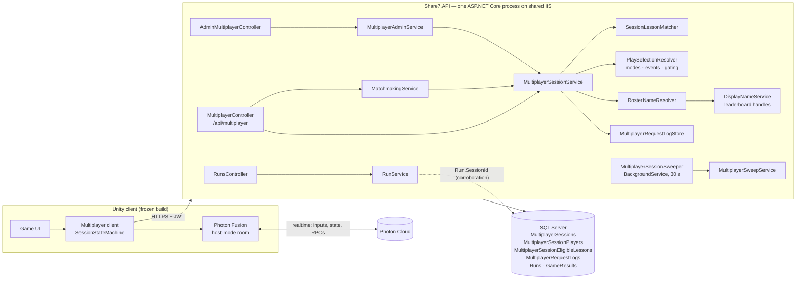
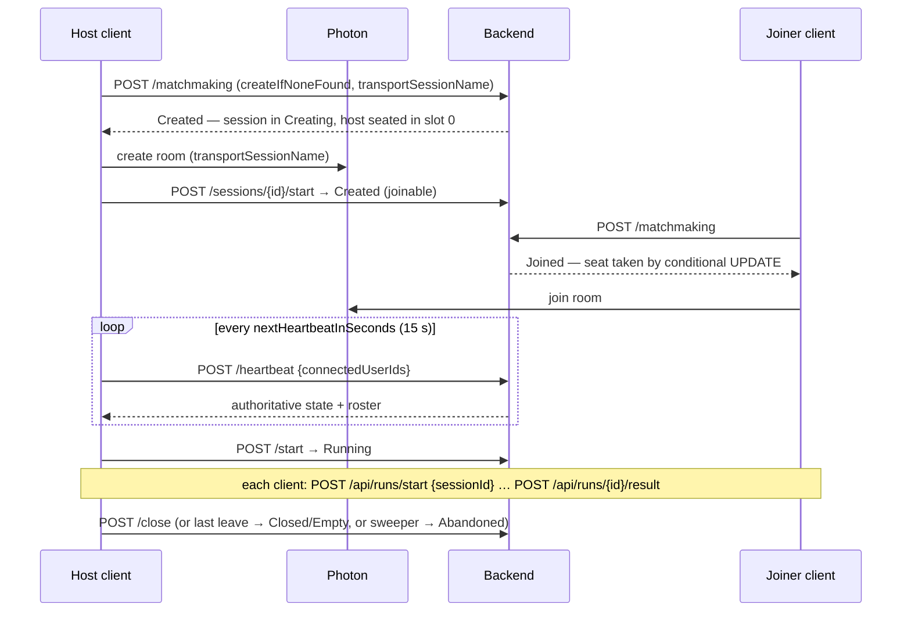
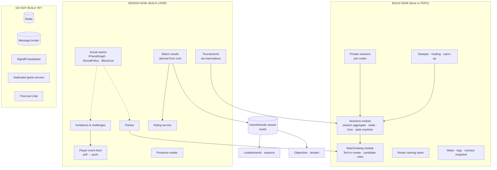

# MultiplayerPlatform.md

# Share7 Multiplayer Platform — audit, architecture and roadmap

The design of record for multiplayer, written 2026-09-30 after a repository-level audit of
everything that exists. It supersedes the "design moves into `Multiplayer.md`" note in
`MultiplayerPlan.md` (that plan is kept as the history of how phases 1–5 were built). The client-facing
contract is in **[MultiplayerUnityContract.md](MultiplayerUnityContract.md)**.

Every claim about current behaviour below cites the code. Every defect called **fixed** has a test
that failed against the code as it was found and passes now.

---

## 0. What landed with this document

| Change | Why | Proof |
|---|---|---|
| Every session transition is a conditional `UPDATE` guarded on **state**, not row version | Leaves and closes that raced a host heartbeat answered 200 and did nothing (F1–F4) | `MultiplayerRaceTests` (4 tests) |
| `UQ_SessionPlayer_OneLiveSeat` — one live seat per account, as an index, with a data-repair migration | Overlapping joins/creates seated one child in two rooms; the ghost sat in a stranger's lobby (F5) | `MultiplayerRaceTests`, `MultiplayerSeatRepairTests` |
| Leave targets the seat held *now* | Leave after rejoin could pick the departed row and do nothing (F6) | `Leaving_after_rejoining_releases_the_seat_held_now` |
| Seated-but-never-connected players are released after `JoinedConnectGraceSeconds` | A player whose app died after the join held the seat until the match ended (F7) | `A_player_seated_but_never_seen_…` |
| Sweeper recount is one statement | A join committing mid-recount was undone; the session then over-admitted (F8) | `The_sweeper_recount_keeps_a_seat_taken_while_it_runs` |
| Roster names are generated handles, not `StudentProfile.FullName` | Strangers in public matches were shown a child's real name (F9) | `Players_matched_together_see_a_generated_handle…` + reviewed contract diff |
| The server-chosen lesson reaches the client in `curriculumPath.lessonId` | Subject matchmaking stamped a lesson nobody could read (F10) | `The_players_are_told_which_lesson_the_server_chose` |
| A subject match started solo still gets a lesson | A 1-player start never stamped one (F11) | `A_subject_match_its_host_starts_alone_still_plays_a_lesson` |
| `POST /api/multiplayer/sessions/join-by-code`, crypto-random codes, own rate limit, rollout flag | Private sessions minted a code nothing accepted (F12) | `MultiplayerPrivateSessionTests` (10), contract test |
| `POST /api/multiplayer/sessions/{id}/remove` — host removes a lobby player; per-session ban checked inside the capacity `UPDATE`; removed players lose read access and are never matchmade back in | A code that reaches the wrong person needs an off switch that actually holds, including against a racing rejoin | `MultiplayerRemovePlayerTests` (10), contract test |
| Sweeper warm-up after process start | A restart longer than 60 s abandoned every live match (F13) | `A_restart_is_not_read_as_every_host_going_quiet` |
| Runs only skip the topology gate for a caller who held a seat in the named session | Any invented `sessionId` let a solo player play a versus-only mode (F14) | `A_run_naming_a_session_it_holds_no_seat_in…` |
| Overlapping retries (same `requestId`) replay the original | A retry racing its own original got `ALREADY_IN_SESSION` / `TRANSPORT_NAME_TAKEN` (F15) | 2 tests in `MultiplayerRaceTests` |
| The heartbeating host is always present | A host omitting itself from its roster was marked missing and could be released (F16) | `A_host_that_does_not_list_itself_is_still_present` |
| Session end + seat release are one transaction everywhere; healing rule in the sweeper | A crash between the two stranded seats (F17) | `A_seat_left_behind_in_an_ended_session_is_released` |
| Explicit state-machine table (`MultiplayerSessionTransitions`) | Transitions were a switch in one method and literals elsewhere | `MultiplayerSessionTransitionsTests` |
| Multiplayer wire-contract snapshot | Nothing guarded the frozen client's multiplayer calls (F18) | `MultiplayerContractTests` + `Snapshots/multiplayer.json` |
| `Share7.Multiplayer` meter + structured logs | The session service had no logging and no metrics at all (F19) | §15 |

Suite: **886 passing, 17 failing — the 17 failures are identical to the baseline taken before any
change** (leaderboard, reward and signal-economy tests colliding on shared fixture data; none touch
multiplayer). 63 tests were added. The frozen game contract passes under all three curriculum read
models.

**One deliberate, visible wire change:** `displayName` on a seat is now the player's public handle
(F9). Same field, same type, same nullability. The re-recorded snapshot diff touched that value and
nothing else. Reversible by configuration (`Multiplayer:RosterNames`), which should not happen
without a product and consent decision.

### 0.1 Phase 1 — server-decided match results, with a win rule chosen per mode (30 Sep 2026)

| Change | Why | Proof |
|---|---|---|
| `MatchResults` + `MatchPlacements`: one verdict per session (key = session id), written once, from each player's own settled run and graded answers | Who won was the client's word (R7) — nothing could rank, pay or award on it | `MatchResultTests` (13) |
| **Win rule per mode** (`GameModes.WinRuleJson`): an ordered list of up to five measures, each "higher wins" or "lower wins"; the first decides, the rest break ties | The operator decides what winning means when creating a mode — last one standing, most kills, most correct then fastest — without a code change | `MatchWinRuleTests` (13), `MatchWinRuleAuthoringTests` (5) |
| Every measure carries a **trust level** the console shows plainly: answers are *verified*; signal counts and time played are *bounded* by what the time played allows; "finished or survived" is *reported* | A configurable rule must not quietly make a client-reported number decide a prize | `Each_metric_says_how_far_the_server_can_vouch_for_it`, `A_count_the_time_played_cannot_explain_places_below_every_clean_player` |
| The rule is **snapshotted onto the verdict** | Editing a mode later must not rewrite who won yesterday | `Changing_a_modes_rule_does_not_re_decide_matches_already_played` |
| `GET /api/multiplayer/sessions/{id}/result` (members only) — `Pending` until everyone reported or `MatchResultGraceSeconds` (120 s) after the match ended; missing players forfeit | The results screen needs one server answer every player agrees on | `A_match_is_pending_until_everyone_has_reported`, `A_player_who_never_reports_forfeits_once_the_grace_period_is_over`, `A_stranger_cannot_read_a_match_result` |
| The sweeper decides matches nobody asked about; gated by the restart warm-up | A match whose players all closed the app still needs its result streamed | `The_sweeper_decides_a_match_nobody_asked_about` |
| `MATCHES_PLAYED` / `MATCHES_WON` into `GameResults`, in the verdict's own transaction; a walkover (fewer than two reported) is not a win | Boards, quests and later ratings consume results with no multiplayer code | `A_decided_match_reaches_the_results_stream_once`, `Two_readers_deciding_at_once_write_one_verdict` |
| Attempts may name their `sessionId`; the first graded attempt on the match's lesson after it started is what answer measures read | Answer measures must come from the server's own grading, not a run's report | `Most_correct_answers_then_fastest_from_graded_attempts`, `An_attempt_naming_a_session_counts_only_for_a_seat_holder_on_the_matchs_lesson` |
| Admin console: "How a match is won" editor in the mode drawer, a "Won by" column, `GET /api/admin/modes/win-metrics?gameId=` | Operators author rules without JSON, and see which ones are self-reported | typecheck, detector, visual check |

Everything is additive: no existing response lost or changed a field, the frozen client never calls
the new route, and a mode without a rule still records its matches — as `Unranked`, placing nobody.

### 0.2 Phase 1, continued — rotation, rematch, Photon authentication (1 Oct 2026)

| Change | Why | Proof |
|---|---|---|
| `POST /sessions/{id}/join-code/rotate` — host, private, pre-match; one guarded `UPDATE` | A code read out to the wrong person could not be taken back | `MultiplayerJoinCodeRotationTests` (8, one deterministic race) |
| `POST /sessions/{id}/rematch` + `MultiplayerSessionReservations` + `UQ_MultiplayerSession_RematchOf`; new refusal `SESSION_RESERVED` | "Rematch" is the post-match loop's first button, and it must bring back the same players and nobody else | `MultiplayerRematchTests` (9, one deterministic race) |
| `POST /transport/ticket` + Photon's `GET/POST /transport/photon-auth` | Anyone who learned a Photon room name could join the room itself (R5 / T1) | `TransportAuthTests` (8), `TransportAuthContractTests` (4, over HTTP) |

Create and rematch share one code path (`CreateCoreAsync`), so a rematch cannot skip a check a create
makes. The frozen client's snapshot is untouched: no existing response gained or lost a field.

Suite after Phase 1: **947 passing, 17 failing — the same 17 as the baseline** (none multiplayer).
The frozen game contract and the multiplayer snapshot pass unchanged.

### 0.3 Phase 2 — social (1 Oct 2026)

| Change | Why | Proof |
|---|---|---|
| **Player feed** — `PlayerEvents` written in the same transaction as the change it reports (the outbox), read by long-poll `GET /api/multiplayer/events`; in-process wake-up on commit (EF save + transaction interceptors), a database re-check every 5 s for other instances; 7-day retention and an honest `410` gap | Invites, challenges and results had nowhere to arrive outside a room; SignalR and a backplane are not justified on shared IIS (§10.3) | `PlayerFeedTests` (8, incl. a waiting read woken by a commit while its fallback poll is set to a minute) |
| **`ISocialPolicy`** — classmates (same active class, active school) or friends; a block either way overrides and reads exactly like "not connected"; real names never | One rule for invites, challenges, presence and parties, changed in one place | `SocialPolicyTests` (7) |
| **Presence** from seats (lobby, match) and the feed poll (online) — no heartbeat of its own; shown only through the policy, on `GET /api/social/connections` | "Who can I play with right now" without a socket or cache server | `SocialPolicyTests` |
| **Blocks** — honoured by matchmaking (never seated together), invites, challenges, friends, parties; withdraws pending invites and ends friendships; the blocked player is never told | Child safety (§15) | `SocialPolicyTests`, `SessionInvitationTests`, `FriendTests` |
| **Session invites** — any seated player, before the match; one pending per room and recipient; accept through the ordinary seat step; declines silent | Friends lobbies without reading codes aloud | `SessionInvitationTests` (10) |
| **Challenges** — asynchronous "beat my score by Friday", settled from the `LESSON_BEST_PERCENT` results stream (no change to grading); live duels as a room reserved for the two plus an invite | The social loop that works when the friend is offline | `ChallengeTests` (8, against real graded attempts) |
| **Friends by code** — 8-character codes, mutual acceptance, `SocialPlay` guardian consent (new `GuardianConsentScope` flag) or 18+, unknown age refused; withdrawing consent ends every friendship at once | "Friends by code" (§15) without stranger requests | `FriendTests` (7) |
| **Parties** — up to 4, one live party per account (filtered unique index), size by conditional `UPDATE`, leader hand-off, "play" opens a room reserved for the party | Groups that stay together between matches | `PartyTests` (7) |
| Account deletion covers every new two-party table, both ways | Erasure must reach the other player's record of you | `SocialDeletionTests`, `AccountDeletionCoverageTests` |

All additive: new tables only (four migrations), new routes only, no change to any existing
response. Reserved rooms (rematch, live challenge, party) share one create path with ordinary rooms.

Suite after Phase 2: **995 passing, 17 failing — the same 17 as the baseline** (none multiplayer or
social). The frozen game contract and the multiplayer snapshot pass unchanged.

### 0.4 Phase 3 — competitive (1 Oct 2026)

| Change | Why | Proof |
|---|---|---|
| **Ratings** — Weng–Lin Bayesian approximation, Bradley–Terry full-pair (the published, unpatented model behind OpenSkill), any number of players with ties in one update; one hidden rating per player per mode; applied once per match (keyed by the match) in the verdict's own transaction, rating rows locked in user order | Ranked needs a skill estimate; the model rates 2–4+ placements directly instead of approximating pairs | `RatingModelTests` (reference values), `RatingServiceTests`, `MatchResultTests` (3 rated) |
| **Only server-formed matches are rated** (`MultiplayerSession.IsRated`, never the client's `isRanked`) | Rating a room two friends opened would let them trade wins | `A_room_the_client_called_ranked_is_never_rated` |
| **Visible seasonal rank** — monthly seasons, 5 placement matches, tier from the conservative estimate (μ − 3σ), **ratcheted to the season's peak: it never drops** | Ranked without loss-aversion (§16) | `No_tier_is_shown_until_placements_are_played_and_then_it_only_climbs` |
| **Ranked playlists** — `GameMode.Ranked`, operator switch in the console; only versus with a win rule; a save that would leave a ranked mode with nothing to rank on is refused | Operators choose what is competitive; the server refuses what it could not rate | `Only_a_versus_mode_with_a_win_rule_can_be_ranked_and_it_stays_that_way` |
| **Ticket matchmaking** (§7.5) — `MatchmakingTickets` (one live ticket per account), a worker every 2 s under `sp_getapplock`, rating bands widening with wait, every matched player **pre-seated** in one transaction, `match_found` on the feed, host no-show → the others requeued keeping their place | Ranked needs the best of many waiting; parties need to be placed as one | `MatchmakingTicketTests` (11, incl. two workers at once) |
| **Party queue (casual)** — group-seated into an open public lobby with room for all (one capacity statement: never split), or a new public room the party hosts that sync players then fill | "Play together with strangers too" without a second matchmaker | two `MatchmakingTicketTests` |
| **Anti-boosting** — ranked is solo-only; a walkover credits nobody but the leaver still loses; the same opponents stop moving each other after 5 rated matches a day; forfeits are last place; blocked pairs never matched | The cheap, explainable defences against farming | `RatingServiceTests`, `MatchResultTests`, `MatchmakingTicketTests` |

All additive: six new tables and two columns (two migrations); the frozen client's `isRanked` keeps
meaning exactly what it meant.

Suite after Phase 3: **1,028 passing, 17 failing — the same 17 as the baseline** (none multiplayer,
social or ranked). The frozen game contract and the multiplayer snapshot pass unchanged.

### 0.5 Phase 4 — tournament foundation and remaining load checks (1 Oct 2026)

Resumed from `main` at `ae8c938`: P4's tournament implementation was already present, but its
verification and client handoff were missing. This continuation completes that backend scope.
See [MultiplayerCompletion.md](MultiplayerCompletion.md) for rollout and deliberate next stages.

| Change | Proof |
|---|---|
| Knockout and Swiss tournaments, classroom authorization, reserved rooms, server-result advancement, organiser decisions and reviewed prizes verified | `TournamentBracketTests`, `TournamentTests`, `TournamentContractTests`; real SQL and HTTP |
| Cancellation between Play preflight and room creation cannot leave an orphan room | Deterministic regression failed before the shared tournament lock and passes after |
| A block added after seeding prevents an unstarted pairing, without revealing the block | Deterministic regression failed before the neutral settlement/re-check and passes after |
| Existing-room Play validates supported and matching protocol versions | `TournamentTests` |
| One non-cancelled tournament per event, enforced by SQL | `TournamentEventOwnership` migration; five simultaneous creations produce one bracket |
| Limited prize quantities remain bounded across concurrent payouts | Deterministic last-prize regression failed with two awards for quantity one; passes with tier row locking |
| The bounded tournament sweeper rotates waiting rows instead of starving later work | 50 waiting tournaments followed by an overdue one; two passes reach and complete it |
| Last-seat storm, API restart recovery and reusable HTTP load driver | 100 joiners: one success, 99 capacity refusals; abrupt process restart recovers the same tournament room; `Share7.Multiplayer.Load` verified against local Kestrel |
| Additive Unity/API handoff | Contract §13, API reference §14; frozen snapshots unchanged |

**Validation:** the full suite reports **1,068 passing, 17 failing, 0 skipped (1,085 total)**.
All 40 added checks pass, as do the frozen game/multiplayer contract checks. The 17 failures remain
in the pre-existing leaderboard, reward and signal-economy fixture group recorded above; the full
suite is therefore **not green**. No unrelated production code was changed to mask those failures.
The API build succeeds with four existing warnings. Fresh isolated SQL databases applied the new
migration successfully.

From the backend repository root:

```powershell
dotnet build Share7/Share7/Share7.API.csproj --no-restore -v minimal
$env:DOTNET_ROLL_FORWARD = 'LatestMajor'
dotnet test Share7/Share7.Tests/Share7.Tests.csproj --no-restore -v minimal
```

The recorded full run took 1m24s. Local evidence: `H:\RUNNER\ScratchEval\multiplayer-full-tests.log`
and `H:\RUNNER\ScratchEval\multiplayer-results\multiplayer-full.trx`. The HTTP smoke used four
dedicated fixture accounts for three seconds: 38 requests, zero failures, approximately 12.5
requests/s including startup and cleanup. This verifies the driver, **not server capacity**;
Photon traffic, SQL outage rehearsals, production rolling deployments and regional latency were
not exercised. No remote upload/migration or Unity screen implementation occurred.

---

## 1. Executive audit

This section records the starting audit on 30 September. The implementation status is §0 and §22;
social, ranked and tournament capabilities described as absent in the original audit now exist.

### Maturity

**Share7 has a well-engineered multiplayer *session registry*, not yet a multiplayer *platform*.**
The part that exists is unusually disciplined — database-enforced capacity, success-only
idempotency, no identity in request bodies, a sweeper that makes crashed hosts recoverable, a real
SQL Server test suite. What does not exist is everything that makes multiplayer social and
competitive: friends, parties, invites, challenges, presence, a server-side match result, ratings,
tournaments, a way to push anything to a player who is not already in a Photon room.

That is the right order to have built things in. It also means the foundation had to be made
correct under concurrency before anything is built on it — which is most of what landed here.

### Strengths (keep these)

- **The database is the arbiter.** Capacity is one conditional `UPDATE`
  ([MultiplayerSessionService.cs](Share7.Infrastructure/Multiplayer/MultiplayerSessionService.cs),
  `SeatCoreAsync`); double-join and duplicate rooms are filtered unique indexes
  ([MultiplayerConfigurations.cs](Share7.Infrastructure/Persistence/Configurations/MultiplayerConfigurations.cs)).
- **No user id in any request body.** Impersonation is not validated against; it is inexpressible.
- **Success-only idempotency** (`MultiplayerRequestLog`) — the commerce lesson applied up front.
- **Server clock everywhere**; `serverTimeUtc` on every response.
- **The realtime transport is not reinvented.** Photon Fusion simulates the match; the backend
  arbitrates membership and authority. For a Unity game at this stage that is the correct split.
- **Results are already server-authoritative for the economy.** Runs are opened by the server with a
  seed, settled against a server-bounded duration and a re-derived layout, capped, flagged and paid
  through one ledger (`RunService`). `GameResult` is an append-only, sequenced stream that
  leaderboards and objectives consume with their own checkpoints — **a de facto event log that
  multiplayer can publish into without new infrastructure.**
- **Adjacent systems already exist**: game modes with topology, seat counts, windows, entitlement and
  grade gating (a playlist in all but name); events with real-world prize claims that store no
  personal data; organizations, cohorts and assignments (the classroom seam); generated public
  handles and guardian-forced unlisting (the child-safety seam); a telemetry pipeline.

### Weaknesses

- **Concurrency correctness had holes exactly where the design said it had none** (F1–F8, F15–F17).
  The capacity path was right; everything around it used read-then-write guarded on a row version
  that heartbeats and joins move constantly.
- **Child safety**: real names to strangers (F9); user GUIDs are still exposed to co-players (§14).
- **The backend cannot see who is in a Photon room.** Membership is enforced only if the host enforces
  it (§14, T1). There is no Photon custom authentication.
- ~~**No match result.**~~ **Fixed in P1 (§0.1, §9.1):** the server decides every match from the
  players' own settled runs and graded answers, under a win rule the operator chose for the mode.
  The client's `match_finished` telemetry remains telemetry.
- ~~**No push channel**~~ **Fixed in P2 (§0.3):** the player feed carries invites, challenges, results
  and party changes to players outside a room, by long-poll.
- **Documentation**: multiplayer was never added to `ApiReference.md`; the plan's phase 6 did not
  happen. The Unity contract now exists.

### Critical risks — status

| # | Risk | Status |
|---|---|---|
| R1 | Silent no-op leave/close under heartbeat traffic → stuck players, `ALREADY_IN_SESSION` loops | **Fixed** (F1, F2) |
| R2 | Ghost seats in strangers' lobbies from retried matchmakes | **Fixed** (F5, F7, F15) |
| R3 | Every deploy longer than 60 s kills every live match | **Fixed** (F13) |
| R4 | A child's real name shown to strangers | **Fixed** (F9) |
| R5 | Photon room joinable by anyone who learns its name, regardless of the backend | **Mitigated in the backend** — Photon custom authentication built (§0.1); closed once the ticket-sending client ships and anonymous Photon access is switched off. The host roster check stays |
| R6 | "Private" session joinable by id | **Mitigated** — join-by-code exists; `RequireJoinCodeForPrivateSessions` closes the id route once the new client ships |
| R7 | Client-reported winner | **Fixed** (§0.1) — the server decides. A rule that ranks on a *reported* measure is still the player's word; the console labels it, and nothing prize-bearing may use one |

### Technical debt worth naming

- `MultiplayerSessionService` is ~1,100 lines and owns create, seat, leave, close, heartbeat, host
  transfer and reads. It is cohesive (one aggregate) and not yet a god class; **split it when the
  second aggregate arrives** (parties or challenges), not before. See §6.
- The error `details` for `SESSION_CLOSED` carry `state` in stored form (`"CLOSED"`) while the DTO
  carries it in wire form (`"Closed"`). Frozen; documented in the Unity contract.
- `curriculumPath` is opaque and unvalidated for exact-lesson sessions: a client can matchmake on a
  lesson it has not unlocked. Harmless today (mastery moves only through `/progress/attempts`, which
  checks unlocks) and noted for when multiplayer results feed progress.

---

## 2. Current architecture (as found, with this change applied)



### 2.1 Components and what they own

| Component | Owns |
|---|---|
| `MultiplayerController` | 12 player routes + join-by-code + remove. Identity from the JWT only. |
| `MultiplayerSessionService` | The session aggregate: create, confirm/start, seat, leave, close, heartbeat, host transfer, reads. |
| `MatchmakingService` | Find-or-create: candidate query, the seat loop, creation fallback. |
| `SessionLessonMatcher` | Subject matchmaking: eligible-lesson intersection, the write-once lesson stamp. |
| `PlaySelectionResolver` (Play) | Mode/context/event validity, topology, entitlement, grade gates. Shared with runs. |
| `RosterNameResolver` *(new)* | The name on a seat. Handles by default. |
| `MultiplayerRequestLogStore` | Success-only idempotency, keyed `(UserId, RequestId)`, 24 h. |
| `MultiplayerSweepService` + `MultiplayerSessionSweeper` | Cleanup rules; a scoped service driven by a timer. |
| `SweeperWarmup` *(new)* | Process start time, so a restart is not read as mass silence. |
| `MultiplayerAdminService` | Operator list / roster / forced close. |
| `RunService` (Runs) | Per-player settlement; corroborates `Run.SessionId` against membership. |
| Photon Fusion (client) | Everything realtime: the room, simulation, host authority, host migration. |

### 2.2 Data ownership

| Data | Where | Authority |
|---|---|---|
| Sessions (= rooms, incl. lobby phase) | `MultiplayerSessions` | Backend |
| Seats | `MultiplayerSessionPlayers` | Backend |
| Candidate lessons | `MultiplayerSessionEligibleLessons` | Backend |
| Idempotency | `MultiplayerRequestLogs` | Backend |
| Queue entries / tickets | **Do not exist** — an open `Created` public session *is* the waiting ticket | — |
| Invitations, parties, friends, presence | **Do not exist** | — |
| Realtime roster (who is in the Photon room) | Photon | **Photon**, reported to the backend by the host |
| Game results | Per player: `Runs` → `GameResults`. Per match: **nothing** | Backend per player; client for "who won" |

### 2.3 State ownership

The backend is authoritative for **membership, capacity, host identity and session state**. Photon
is authoritative for **realtime presence and simulation**. The host bridges them with a heartbeat
carrying its live roster; the backend treats that as presence, never membership. When they
disagree about membership or authority, the backend wins — **but only if the host acts on it** (T1).

### 2.4 Lifecycle



### 2.5 Realtime model

There is **no backend realtime channel**: no SignalR, no WebSockets. All in-match realtime is Photon.
Backend state reaches clients by polling: the host every heartbeat, everyone else via
`GET /sessions/{id}`. That is adequate for everything that happens *inside* a room and inadequate for
anything that must reach a player *outside* one (§10).

### 2.6 Persistence

Everything is in SQL Server and survives restarts. Nothing multiplayer is process-local except the
rate limiter partitions (in-memory, per process) and `SweeperWarmup`'s clock.

### 2.7 Concurrency model (after this change)

- **Capacity**: one conditional `UPDATE … WHERE CurrentPlayerCount < MaxPlayers`. Unchanged.
- **Membership**: three filtered unique indexes — same user twice in a session, same slot twice,
  and now **same user in any two live sessions** (`UQ_SessionPlayer_OneLiveSeat`).
- **State**: every move is `UPDATE … WHERE State = @expected [AND HostUserId = @caller]`; the legal
  sources come from `MultiplayerSessionTransitions`. Zero rows → re-read and report what changed.
- **Host**: compare-and-swap on `HostUserId` itself, with the target's seat re-checked in the same
  statement. Exactly one of simultaneous claims wins; heartbeats and joins cannot make it lose.
- **Lock order**: every multi-statement transaction touches the session row first (the capacity
  `UPDATE`, or an explicit `UPDLOCK` read in leave), then seats. Statements outside a transaction
  hold nothing. That is what keeps two leaves, a join and a close on one session from deadlocking.
- **Row versions** are still on both tables and still used by EF for tracked saves; they no longer
  arbitrate any lifecycle move.

### 2.8 Scaling model

One process, one SQL Server, no cache. Every instance could safely run the sweeper (all rules are
idempotent and guarded). Multiple API instances would work today for correctness; the in-memory rate
limiter would become per-instance (weaker), and `SweeperWarmup` per-instance (harmless).

### 2.9 Failure model

| Failure | What happens now |
|---|---|
| **API process dies / deploys** | Sessions persist. Photon matches continue. Heartbeats fail and are retried by the client. For one silence window after restart the sweeper does not abandon, fail or release anything (F13), so hosts reconnect into live sessions. |
| **Redis dies** | No Redis. |
| **Database slow** | Requests slow; the client retries with the same `requestId` and is answered from the log or re-evaluated. The sweeper's batched, bounded passes cannot hold long transactions. |
| **Player disconnects** | Host stops reporting them → `Disconnected` after `PlayerDisconnectGraceSeconds` (45 s) → sweeper releases the seat 45 s later. A player seated but never seen gets `JoinedConnectGraceSeconds` (60 s) first. |
| **Host disconnects** | Members may claim host after `HostClaimGraceSeconds` (30 s). If nobody claims and heartbeats stop, the session is abandoned after 60 s. |
| **Duplicate request** | Sequential duplicate: replayed from the log. Overlapping duplicate: one wins at an index; the loser replays the winner's answer if it has been recorded, otherwise gets `ALREADY_IN_SESSION` and recovers with `GET /sessions`. |
| **Network retry after success, response lost** | Same as a sequential duplicate. |
| **"Worker crashes halfway through creating a match"** | There is no worker. A create is one transaction; a crash leaves either nothing or a complete `Creating` session that the host confirms or the sweeper fails after 30 s. |
| **Crash between "session ended" and "seats released"** | Impossible now (one transaction). Legacy rows: repaired by the migration and by the sweeper's healing rule. |

---

## 3. Audit findings

Severity: **C** critical, **H** high, **M** medium, **L** low.

| # | Sev | Finding | Evidence (as found) | Status |
|---|---|---|---|---|
| F1 | C | Leave racing a heartbeat or join: row-version conflict read as "someone else did it"; 200 returned, seat kept | `LeaveAsync` `catch (DbUpdateConcurrencyException)` returned success | Fixed |
| F2 | C | Close racing a heartbeat: same; session stayed live | `ApplyCloseAsync` swallowed the conflict | Fixed |
| F3 | M | Start racing a heartbeat: `SESSION_INVALID_TRANSITION` for no reason | `StartAsync` RowVersion guard | Fixed |
| F4 | M | Voluntary host transfer racing a heartbeat: `HOST_STILL_ACTIVE`, "another claim reached first" with no other claim | `TransferHostAsync` | Fixed |
| F5 | H | One account seated in two sessions by overlapping join/create/matchmake; the check was a read | `SeatAsync` comment admitted it; `ApiErrors.AlreadyInSession` doc claimed an index enforced it | Fixed (index + migration) |
| F6 | H | Leave after rejoin read an arbitrary membership row; could return "already left" and keep the live seat | `FirstOrDefaultAsync(p => p.SessionId == … && p.UserId == …)` without status or order | Fixed |
| F7 | H | `Joined` members never timed out; only `Connected` were demoted | `HeartbeatAsync` loop | Fixed |
| F8 | M | Sweeper recount was read-then-write; a join between them was undone → over-capacity | `ReleaseDisconnectedPlayersAsync` | Fixed |
| F9 | H | Roster `displayName` = `StudentProfile.FullName` shown to strangers | `ResolveDisplayNamesAsync`; leaderboards forbid exactly this (`PlayerDisplayName` summary) | Fixed |
| F10 | H | Subject matchmaking's stamped lesson never appeared in any response | `ToDto` echoed `CurriculumPathJson` only | Fixed |
| F11 | M | Subject session started by one player never stamped a lesson | `TryStampLessonAsync` requires ≥ 2 seated | Fixed |
| F12 | H | Private session code generated with `Random.Shared` and accepted by no route | `GenerateJoinCode`; controller | Fixed (+ flag for id route) |
| F13 | H | Restart > 60 s → every live session abandoned; hosts told to tear down | `AbandonSilentAsync` with no notion of downtime | Fixed |
| F14 | M | `PlayerCount = sessionId is null ? 1 : 0` let any invented session id bypass the topology gate | `RunService.StartAsync` | Fixed |
| F15 | M | Overlapping retry with the same `requestId` refused instead of replayed | log is success-only and written after commit | Fixed (replay-on-conflict) |
| F16 | L | Host omitted from its own roster → marked `Disconnected` → releasable | `HeartbeatAsync` | Fixed |
| F17 | M | Session terminal write and seat release were separate autocommit statements in the sweeper | `AbandonSilentAsync` + `DepartMembershipsAsync` | Fixed (+ healing rule) |
| F18 | H | No wire-contract test for multiplayer despite a frozen client | `Contracts/Snapshots` | Fixed |
| F19 | M | No logging or metrics in the session service | — | Fixed (baseline) |
| F20 | L | Heartbeat `connectedUserIds` unbounded | — | Fixed (first 64 read) |
| T1 | H | Photon room membership is not verified by anything but the host | architecture | **Open** — §14 |
| T2 | M | Co-players see each other's account GUIDs | DTO `userId`, `hostUserId` | **Open** — v2 contract, §14 |
| T3 | M | Match winner is client-reported | no result route; telemetry only | **Open** — §9 |
| T4 | L | `curriculumPath.lessonId` unvalidated for exact-lesson sessions | `CreateAsync` | **Open** — harmless until results feed progress |
| T5 | L | Kicked/left members keep read access to the session they were in | `IsMemberAsync` "ever held a seat" | **Accepted** — needed for idempotent close and post-match reads |

### Overengineering check

Nothing in the current implementation is overbuilt. The absence of Redis, a queue, a worker and
distributed locks is *correct* at this scale (§17). The plan's decision to replace the Redis/Hangfire
design with SQL (`MultiplayerPlan.md` §3.6) was right and is reaffirmed.

---

## 4. The multiplayer vocabulary

**One word, one thing.** These are the terms every future PR and every Unity class should use.

| Term | Definition | Exists? |
|---|---|---|
| **Session** | The backend's record of one Photon room, from `Creating` to terminal. Covers the lobby phase *and* the match phase. Table `MultiplayerSessions`. | ✅ |
| **Lobby** | A **state of a session** (`Created`: joinable, waiting). **Not an entity** — see below. | ✅ as state |
| **Seat** | One account's membership of one session. Table `MultiplayerSessionPlayers`. | ✅ |
| **Host** | The seat holding authority; the only one that confirms, starts, heartbeats, closes. | ✅ |
| **Match** | The gameplay portion of a session (`Running` → `Ending`) and its outcome. | ✅ |
| **Match result** | The server-derived outcome of a match: placements computed from the players' settled runs and graded answers. Tables `MatchResults`, `MatchPlacements`. | ✅ §9.1 |
| **Win rule** | A mode's ordered list of measures (metric + which way wins) that places a match's players. Snapshotted onto each result. | ✅ §9.1 |
| **Measure trust** | How far the server can vouch for a measure: *verified* (graded by the server), *bounded* (reported, capped by time played), *reported* (the player's word). | ✅ §9.1 |
| **Playlist** | A game + mode + context (+ event): *what* is played and on what terms. **Implemented as `GameMode` + `PlayContextKind` + `PlayEvent`** — no new entity. | ✅ |
| **Matchmaking request** | One call to `/matchmaking`. Synchronous. | ✅ |
| **Ticket** | A persisted, asynchronous "find me a match" request. **Only for ranked and parties** — casual solo keeps the session-as-ticket (§7). | ✅ §7.5 |
| **Party** | A persistent group that moves between sessions together. Queueing as one waits for tickets. | ✅ §8.3 (reserved rooms; no queue yet) |
| **Invitation** | An offer to join a session or party, addressed to one account. | ✅ §8.4 |
| **Challenge** | An invitation to a specific contest (live duel or asynchronous score attempt), with expiry. | ✅ §8.4 |
| **Presence** | Where a player is: offline, online, in lobby, in match. ("In lesson" is not tracked.) | ✅ §0.3 |
| **Rating** | Hidden skill estimate per mode. Separate from **Rank** (visible tier, monthly, never drops within a season). | ✅ §9.2 |
| **Season** | A leaderboard cycle. **Already exists** (`LeaderboardCycle`); no new concept. | ✅ |
| **Tournament** | A structure that *reserves* sessions for known rosters and advances on results. | ❌ §9 |
| **Reservation** | A session created for a named roster; only those accounts may take seats. | ❌ §7 |

**Party ≠ Session ≠ Match.** A party outlives sessions; a session holds one match (a rematch is a new
session, §12); a match is what is played in a running session.

**Why no Lobby entity.** A separate lobby table would duplicate the session's membership, capacity
and host with a second copy to keep consistent — and Photon's room already *is* the lobby. The
session in `Created` is the lobby. If "lobby then pick a game" flows appear (choose a mode *after*
gathering), that is a **party** in the lobby phase, not a new entity.

**Why no Room entity.** "Room" is Photon's word for the same thing a session registers. Use
*session* on the backend, *room* only when talking about the transport.

---

## 5. The player experience the architecture must serve

The brief's success test — "I opened Share7 to study for a few minutes and ended up playing
challenges with my friends for an hour" — describes a loop, not a feature:

```
PLAY  →  RESULT  →  PROGRESS  →  SOCIAL RESPONSE  →  NEW GOAL  →  PLAY AGAIN
```

### 5.1 The five questions, and which system answers each

| Question | Answered by | Backend status |
|---|---|---|
| **Who can I play with?** | Friends (social graph), classmates (cohorts), party, "anyone" (matchmaking) | Cohorts exist; friends/party are seams (§8) |
| **What can I play?** | Modes offered to me now (`PlaySelectionResolver`) × lessons I have unlocked (`SessionLessonMatcher`) | ✅ |
| **Why should I play?** | Events, objectives/quests, streaks, seasonal boards, rivals | Events, objectives, streaks, boards ✅; rivals ❌ |
| **What happens if I win?** | A server-derived result feeding rewards, boards, quests, rating | ❌ — the single largest gap (§9) |
| **What should I do next?** | Post-match: rematch, challenge, next lesson, next match | Rematch/challenge ❌ (§12) |

### 5.2 Entry points

Every one of these is a **client surface over the same few backend calls** — which is the point:
multiplayer is woven through the product by making its primitives cheap to call from anywhere.

| Entry point | Backend call |
|---|---|
| Home "Play with someone" | `POST /matchmaking` with the player's current subject |
| Subject page "Find someone studying Maths" | `POST /matchmaking` with `curriculumPath.subjectId` |
| Lesson / quiz "Challenge a friend on this lesson" | Challenge (P2) with `curriculumPath.lessonId` |
| Friend profile "Play" | Invite to a private session (P2), today: share the join code |
| Event card | `POST /matchmaking` with `eventId` |
| Post-match "Rematch" | Rematch (P1, §12) |
| Classroom (teacher) | Reserved sessions for a cohort (P3, §9) |

### 5.3 What the platform must never do to a child

No free-text chat with strangers, no discoverability by real name, no stranger friend requests, no
cross-school contact without an explicit institutional or guardian decision, no loot-box or
streak-anxiety mechanics. §14 and §16.

---

## 6. Target architecture

**A modular monolith.** One deployable, one database, modules with explicit seams. Not
microservices: there is one team, one Unity client, one SQL Server, and a shared-IIS host — every
service boundary would buy network failure modes and nothing else. Logical modularity first; a
module is extracted only when its *scale* differs from the rest (the heartbeat path is the first
candidate, §17).



### 6.1 Module boundaries

| Module | Owns | Talks to others only through |
|---|---|---|
| **Sessions** | session, seats, host, state machine, join codes | `IMultiplayerSessionService`; emits nothing yet |
| **Matchmaking** | candidate discovery, scoring, relaxation | `SeatAsync` / `CreateAsync` on Sessions |
| **Results** *(built — `MatchResultService`)* | match result derivation, placements, win-rule evaluation | reads Runs and `MatchAttemptScores`; writes `MatchResults` and `GameResults`; rating via `IRatingService` (P3) |
| **Social** *(seams)* | friends, blocks, policy | `IFriendGraph`, `IBlockList`, `ISocialPolicy` |
| **Parties** *(later)* | party, members, leader | Matchmaking (party tickets), Feed |
| **Notifications/Feed** *(later)* | per-player ordered event feed | producers call `IPlayerEventPublisher` |
| **Competitive** *(later)* | ratings, ranked playlists, tournaments | Results, Sessions (reservations), Leaderboards |

**The rule that keeps it extensible:** producers never call consumers. Multiplayer never calls
`battlePass.AddXp(50)`. It writes a `GameResult` (or, later, a feed event) and the progression
systems that already consume that stream decide what it is worth.

### 6.2 Seams to introduce (as interfaces, when first needed — not before)

```csharp
// Social — P2. The null implementations are the product decision for today.
public interface IFriendGraph   { Task<bool> AreFriendsAsync(Guid a, Guid b, CancellationToken ct); Task<IReadOnlyList<Guid>> FriendsOfAsync(Guid user, CancellationToken ct); }
public interface IBlockList     { Task<bool> IsBlockedEitherWayAsync(Guid a, Guid b, CancellationToken ct); }
public interface ISocialPolicy  { Task<SocialPermission> CanInteractAsync(Guid actor, Guid target, SocialAction action, CancellationToken ct); }
//   SocialAction: Invite, Challenge, SeeRealName, SeePresence, React
//   today: Invite/Challenge = only via a join code or same active cohort; SeeRealName = never.

// Presence — P2
public interface IPresenceReader { Task<IReadOnlyDictionary<Guid, PlayerPresence>> GetAsync(IReadOnlyCollection<Guid> users, Guid viewer, CancellationToken ct); }

// Feed — P2
public interface IPlayerEventPublisher { Task PublishAsync(Guid recipient, PlayerEvent evt, CancellationToken ct); } // same transaction as the change

// Competitive — P3
public interface IRatingService { Task<RatingChange> ApplyAsync(MatchResult result, CancellationToken ct); }
```

`IRosterNameResolver` is the pattern: one seam, one safe default, and the future (friends see first
names, with guardian consent) is a new implementation rather than a change to every endpoint.

---

## 7. Matchmaking architecture

### 7.1 What exists, and why it is the right shape for now

**Session-as-ticket, synchronous find-or-create.** A player who finds nothing creates a public session
and waits in it; that open session *is* their ticket. The next player's search finds it. One indexed
read, then the atomic seat — no queue, no worker, no lock. At Share7's scale this is strictly better
than a ticket queue: nothing to crash halfway, nothing to reconcile, no second source of truth.

Its limits are real and known: it matches the **first** compatible player, not the **best**, and it
cannot queue a group. Both are fine for casual subject play; both break for ranked and parties.

### 7.2 The rule pipeline — how it evolves without a rewrite

```
Hard constraints (SQL WHERE)          game, mode, event, protocol, ranked flag, state, visibility,
                                      freshness, capacity, language, lesson or subject overlap
        ↓
Candidate discovery (indexed read)    ≤ MatchmakingCandidateLimit rows
        ↓
Scoring (in memory, per playlist)     today: fullest first, then oldest
        ↓
Seat attempt (atomic, per candidate)  the only step that decides anything
        ↓
Fallback                              create and wait (the new ticket)
```

**Adding a dimension** (mastery, rating, region) means: a column on the session (the host's value),
a hard band in the WHERE, and a term in the score. **The seat step never changes.** That is the
extensibility property to protect.

### 7.3 Scoring (when the second dimension arrives)

A configurable weighted score over the small candidate set — per playlist, in configuration:

```
score = w_fill  · fill(candidate)                 // shortest wait for everyone
      + w_age   · age(candidate)                  // nobody starves
      + w_skill · (1 − |Δskill| / band(age))      // P3
      + w_learn · lessonOverlap(candidate)         // shared weak lessons, not just any lesson
      + w_social· knownPlayers(candidate)          // P2: classmates/friends first
```

**Do not implement this equation now.** There is one dimension today; a scoring framework for one
term is abstraction with theoretical value only. Build it with the first skill-based playlist.

### 7.4 Search expansion

Relaxation belongs to the **waiting session**, because it is the ticket: the longer it has waited,
the wider the band a joiner may land in. Expressed as a per-playlist schedule over
`now − CreatedAtUtc` of the candidate:

| Waited | Skill band | Curriculum | Fallback |
|---|---|---|---|
| 0–10 s | tight | exact lesson or shared weak lesson | — |
| 10–25 s | wider | any shared lesson in subject | — |
| 25–45 s | wide | any shared lesson in subject | — |
| 45 s+ | any | any shared lesson | offer "play solo while you wait" / invite a friend |

Numbers are placeholders to tune from `share7.multiplayer.matchmaking.duration` and match-quality
data, not constants to ship.

### 7.5 Asynchronous tickets (built in P3)

**As built:** `MatchmakingTickets` + members (`UQ_MatchmakingTicketMember_Live`) + per-ticket shared
lessons; `MatchmakingWorker` every `TicketIntervalSeconds` (2) runs one pass under `sp_getapplock`
(session-owned, no wait): expire → requeue players of matches whose host never confirmed (keeping
their place; the host's ticket ends) → place casual tickets into open public lobbies (group seat) →
form new matches greedily per pool (game, mode, event, ranked, protocol, language, curriculum),
anchored on the longest wait, ranked candidates within `RankedBandBase + RankedBandGrowthPerSecond ×
wait` (cap `RankedBandMax`), blocked pairs never grouped, subject lessons intersected. Each formation
is one transaction — tickets claimed, session created with **every player already seated**
(`CreateFormedAsync`), events staged — so a lost race leaves nothing. Rated matches are private and
exactly the matched size; casual ones public with room for the sync population to fill. The design:


When either **parties** queue (a group must be matched as one) or **ranked** needs to pick the best
of many waiting players. Then: a `MatchmakingTickets` table, a worker that forms matches from tickets
in a pool (claimed under a lease, like `LeaderboardJob`), and a **reservation**: the worker creates
the session with a named roster, and only those accounts can take its seats. The seat step still
does the deciding. Tickets reach the client through the event feed (`matchmaking.match_found`).

### 7.6 Concurrency and persistence

Every matchmaking guarantee reduces to the seat step and the indexes (§2.7). A candidate that fills
between discovery and seating fails its `UPDATE` and the loop moves on. An account that picks up a
seat elsewhere mid-search is stopped by the one-live-seat index.

---

## 8. Rooms, parties, invitations, challenges

### 8.1 Private sessions (built)

- Created with `visibility: "Private"`; never offered by matchmaking.
- 6-character code from a 32-letter unambiguous alphabet, **cryptographic RNG**, unique among live
  sessions (index), released when the session ends.
- `POST /sessions/join-by-code` — code in the body, never the URL; case/space/hyphen-insensitive;
  **one refusal (`SESSION_NOT_FOUND`) for unknown, ended and malformed codes**; sliding-window limit
  of 10/min/user (`RateLimiting:JoinCodePermitsPerMinute`).
- `Multiplayer:RequireJoinCodeForPrivateSessions` (off) closes the by-id route for strangers once the
  client that joins by code ships; anyone who has held a seat keeps it for reconnects.
- QR codes and deep links are **client renderings of the same code** (`share7://join/K3F9QA`) — no
  backend change.

**Host removal (built).** `POST /sessions/{id}/remove { userId }`, host only, **before the match
only** (`Creating`/`Created`) — closing is available for a running match, and removing one player
mid-match would let a host hand a child a loss. The seat goes to `Removed` and a
`MultiplayerSessionBans` row keeps the account out until the session ends:

- the ban is checked **inside the capacity `UPDATE`** (`NOT EXISTS`), not by a read beforehand, and the
  removal holds the session row while it writes the ban — so a rejoin racing the removal either lands
  first and is removed with it, or queues and is refused;
- rejoining by id, by code or via matchmaking answers `SESSION_REMOVED` (403, to the removed account
  only); matchmaking filters the lobby out of the candidates entirely;
- a removed account loses **read** access too (`IsMemberAsync` excludes bans) — watching a lobby you
  were removed from is exactly what removal should stop;
- idempotent at the ban's key; the host must also disconnect the peer from Photon (client obligation).

**Code rotation — done (P1):** `POST /sessions/{id}/join-code/rotate`, host only, private, pre-match; one
guarded `UPDATE`; a retry returns the code it minted. **Next:** ready states only if the game needs
them server-side (today Photon owns ready).

### 8.2 Public room browser — design, do not build yet

Photon's own lobby list already serves discovery. A backend browser is justified only when it must
filter on things Photon does not know (subject, cohort, friends present). Design when needed:
`GET /sessions/public?gameId&modeKey&subjectId&page` over the existing
`IX_MultiplayerSession_SubjectMatchmaking` index, cached for 2–5 s, never listing sessions with a
stale heartbeat. **Child safety decides whether it ships at all** (§14): a browsable list of rooms of
children is a discovery surface for strangers.

### 8.3 Parties (built in P2 — without queueing)

**As built:** `Parties` (leader, state, `MaxSize` 4, `MemberCount`, `CurrentSessionId`), `PartyMembers`
with `UQ_PartyMember_OneLiveParty` (one live party per account), `PartyInvitations`. Size is one
conditional `UPDATE` on `MemberCount`; every membership change locks the party row first. Joining a
party moves a player out of their old one. A leader leaving hands over to the longest-standing
member; the last one out disbands it. "Play" opens a room reserved for exactly the party
(`PARTY_MEMBER_BUSY` with the ids while anyone is in another room) and sends
`multiplayer.party.play_started`. **Not built:** queueing a party into public matchmaking (needs
tickets, P3), automatic leader hand-off on silence, per-member content checks before play (the seat
step still refuses a member who cannot play the lesson). The design it was built from:

A party is a small persistent group (≤ the smallest max seat count it will queue for) with a leader.

- Tables: `Parties (Id, LeaderUserId, State, CreatedAtUtc, RowVersion)`,
  `PartyMembers (PartyId, UserId, Role, JoinedAtUtc, LeftAtUtc)` with a filtered unique index
  "one live party per account" — the same pattern as seats.
- Queueing: the leader matchmakes; the party becomes one ticket (P3) or, before tickets exist, the
  leader creates a **reserved** session and members are seated by reservation.
- Leader disconnect → lowest-joined member becomes leader after a grace (same rule as host claim).
- A member already in a session cannot be queued; the party refuses with the member's id in `details`.
- Party changes during matchmaking cancel the party's ticket.
- A member lacking required content (lesson not unlocked, mode not entitled) is reported per member
  before queueing, not discovered at seat time.

### 8.4 Invitations and challenges (built in P2)

**As built:** `SessionInvitations` and `PartyInvitations` (one pending per target and recipient, by
filtered unique index — repeated presses collapse), `Challenges` (one open per challenger, recipient
and lesson). Asynchronous challenges read the bar from the challenger's best graded percent and the
recipient's attempts from the `LESSON_BEST_PERCENT` results stream — graded answers rather than a
client-reported run, and no change to the attempt path; the sweeper and every list settle them.
Declines are silent by design. The design:

Both are rows with an addressee, a target, an expiry and a state machine
(`Pending → Accepted | Declined | Cancelled | Expired`), created only when `ISocialPolicy` allows
it, delivered through the event feed, idempotent on `(sender, recipient, target, requestId)`.

- **Live challenge** = invitation to a private session created for the pair.
- **Asynchronous challenge** = "beat my score on this lesson by Friday": the challenger's settled run
  is the bar; the recipient's run within the window is compared **server-side** (§9). No session
  needed at all — which is why asynchronous challenges should ship *before* live ones: they work when
  the friend is offline, which is most of the time.
- Duplicate challenges collapse to one pending per (sender, recipient, target).

---

## 9. Competitive architecture — results first

### 9.1 Server-derived match results, decided by a win rule chosen per mode (built, P1)

**Never trust the client for who won.** Each player's run is server-opened, server-bounded and
settled, and carries the session id; each graded attempt can name the session. The server decides
from those — no client ever sends a verdict.

**The win rule — "what makes a player win" is the operator's choice, per mode.** When creating or
editing a mode played versus, the operator picks an ordered list of up to five measures, each with
a direction. The first measure decides; each later one only breaks the ties the earlier ones left.

| Measure (`metric`) | Source | Trust | Typical use |
|---|---|---|---|
| `correct_answers` | the server's own grading of the attempt on the match's lesson | **verified** | quiz duel |
| `accuracy` | correct ÷ total, same attempt | **verified** | tiebreak |
| `duration_ms` | the run's played time, clamped to the match window | **bounded** | race (lower wins) or survival (higher wins) |
| `signal:<kind>` | a count the game reports on its run (`signal:kill`, `signal:coin`, …) — any kind, including ones no valuation lists yet | **bounded** — a count above what the time played allows (`SignalValuation.MaxPerSecond`, else `MaxPickupsPerSecond`) flags the player, who is placed below every clean player | kills, collectibles |
| `outcome` | whether the run finished/survived | **reported** — the player's word | last one standing |

A "PUBG" mode is `outcome` higher → `signal:kill` higher → `duration_ms` higher; a quiz duel is
`correct_answers` higher → `duration_ms` lower. `signal:correct_answer` is refused: answers come only
from grading. A rule is only as trustworthy as its weakest measure; the console says so in words
("The player's own report") and warns against putting prizes or events on a reported rule.

**Deciding a match.**

1. Participants are the seats held when the match started (joined by `StartedAtUtc`, not left before
   it, not removed).
2. A match is decided as soon as every participant has reported (settled run or graded attempt), or
   `MatchResultGraceSeconds` (120 s) after it ended — then anyone still missing **forfeits** and is
   placed last. A `GET /sessions/{id}/result` decides it on read; the sweeper decides the rest
   (after the restart warm-up only).
3. Standard competition ranking (1, 1, 3): equal players share a placement, and every player placed
   first is a winner.
4. `MatchResults` (key = session id, so exactly one verdict ever lands; a racing decider reads the
   winner) and `MatchPlacements` are written once. **The rule is snapshotted onto the result** —
   editing the mode never re-decides a played match.
5. In the same transaction, `GameResult` rows go to the stream: `MATCHES_PLAYED` for every player who
   reported, `MATCHES_WON` for winners **only if at least two reported** (a walkover is not a win),
   under the context's settlement policy (event entry → Event, otherwise FreePlay). Boards,
   objectives and later ratings consume them with no multiplayer code.
6. A mode with no rule still records its matches as `Unranked` — played, nobody placed.

Deliberately *not* done: daily signal caps (an economy rule) never affect ranking; the rule is not
per-event (an event pins a mode, and the mode carries the rule); there is no free-form expression
language — five ordered measures cover every mode the catalogue has, and stay explainable to a child
on a results screen.

### 9.2 Ratings (built in P3)

**As built:** Weng–Lin Bradley–Terry full-pair (μ₀ 25, σ₀ 25/3, β 25/6, κ 0.0001, τ 25/300), per
(player, mode); `PlayerRatingChanges` is both the once-per-match key and the audit trail;
`RankedSeasonStandings` holds the visible projection (monthly; placements; peak ratchet; σ softened by
`RankedSeasonSigmaBump` at a player's first match of a season). The visible tier never reveals μ.


`PlayerRatings (UserId, PlaylistKey, Mu, Sigma, GamesPlayed, UpdatedAtUtc)` updated from
`MatchResults` by `IRatingService`. Choose a published model (Glicko-2 or TrueSkill-style for
multi-player placements) at build time; **matchmaking rating is never the visible rank**. Visible rank
is a seasonal projection (a leaderboard cycle already provides seasons and resets). Placement matches
= high initial sigma. Party restrictions and anti-boosting live in the ranked playlist's rules.

### 9.3 Tournaments (P4 foundation built, §0.5)

A tournament orchestrates **reserved sessions**: bracket → reservation per match → check-in (seat
by reservation) → play → `MatchResult` → advance. It uses Sessions and Results; ordinary matchmaking
never knows it exists. **Single elimination and Swiss are implemented** in `TournamentBracket` and
`TournamentService`. Double elimination, round robin and teams remain future format strategies over
the same reservation primitive. Classroom tournaments are scoped to a cohort and created by an
authorized teacher; the organiser may start, cancel and resolve disputes, with admin overrides and
audit records. Public identities are handles. A later block prevents an unstarted pairing without
disclosing the block; a started match retains its server result.

Completion emits tournament metrics into `GameResults` once, so leaderboard consumers can reuse
them. Optional event prizes use the existing review/claim flow. The Unity flow, retry keys, deadlines,
feed events, errors and exact DTOs are documented in `MultiplayerUnityContract.md` §13.

### 9.4 Real prizes (P4+)

The event prize system already records awards and claims with **no personal data** and a
human-reviewed claim workflow. For prize-bearing multiplayer: results must come from §9.1 (derived,
append-only), flagged runs cannot place, collusion signals (same pair repeatedly, one always
forfeiting) feed the review queue, and `AuditEvents` records every decision. Account verification and
geographic/age eligibility are **event eligibility rules** (exists: `PC_EVENT_NOT_ELIGIBLE`), not
multiplayer concerns.

---

## 10. Realtime architecture

### 10.1 Keep Photon for everything inside a room

In-match realtime (inputs, state, RPCs, emojis between players already in a room) is Photon's job
and should stay there. Building a second in-match channel on the backend would add latency and cost
and remove nothing.

### 10.2 A per-player event feed for everything outside a room (built in P2)

**As built**, exactly as designed below, plus two things the design left open. **Wake-up:** a waiting
read arms an in-process signal *before* it queries, and EF interceptors (`SaveChanges` and transaction
commit) fire it only once the rows are committed — so a waiting client hears an invite within
milliseconds on the same instance, and never wakes into rows it cannot see. **Other instances:** the
wait re-checks the database every `EventFallbackPollSeconds` (5), so a scaled-out API still delivers
within seconds with no backplane. The poll doubles as presence (`PlayerPresence`, written at most every
30 s per player). Invites, challenges, party updates, "match found" for tickets, prize notifications. Design:

- `PlayerEvents (Sequence bigint identity, RecipientUserId, EventId uniqueidentifier, Type, Version,
  PayloadJson, OccurredAtUtc, ExpiresAtUtc)`, index `(RecipientUserId, Sequence)`.
- Written **in the same transaction** as the change it describes — that is the outbox; there is no
  separate outbox table and no broker.
- `GET /api/multiplayer/events?after={sequence}&wait=25` — long-poll; returns ordered events after the
  cursor. Works on shared IIS, survives restarts, gives ordering and replay for free.
- Envelope: `{ sequence, eventId, type, version, occurredAtUtc, payload }`. Types are
  `domain.noun.pastTense`: `multiplayer.invite.received`, `multiplayer.challenge.received`,
  `multiplayer.party.updated`, `multiplayer.matchmaking.match_found`, `multiplayer.session.ended`.
- **At-least-once, ordered per recipient, idempotent by `eventId`.** A client that sees a cursor gap
  older than retention (7 days) re-reads state (`GET /sessions`, …) instead of events.
- **SignalR later, as an accelerator only**: a push "you have events after N" hint over the same feed.
  The feed stays the source of truth, so a missed push costs one poll interval and nothing else.

### 10.3 Why not SignalR now

Shared IIS gives no guarantee of WebSocket support or process lifetime; scale-out needs a backplane
(Redis or Azure SignalR) — infrastructure with no current producer to justify it. The feed solves
ordering, replay, authorization and reconnection *first*; push is then a latency optimisation.

### 10.4 Reactions and emojis (P1, client + Photon)

Curated set only (👋 😂 🔥 GG, "Nice!", "Rematch?"), sent as a Photon RPC between players already in a
room, rate-limited client-side (1/2 s) and by the host. **No backend change** unless reactions must
reach players outside the room (post-match screen after leaving) — then they become feed events with
the same curated enum, `ISocialPolicy`-gated, muted per session on request. **Free text: do not build**
(§14).

---

## 11. Data model

### 11.1 Current tables, indexes mapped to the queries that use them

| Index | Query it serves |
|---|---|
| `UQ_MultiplayerSession_Transport` (TransportSessionName, live) | duplicate-room defence on create |
| `UQ_MultiplayerSession_JoinCode` (JoinCode, live & not null) | code uniqueness; **join-by-code lookup** |
| `IX_MultiplayerSession_Matchmaking` (GameId, State, Visibility, IsRanked, ProtocolVersion, LessonId) incl. counts/heartbeat | exact-lesson candidate query |
| `IX_MultiplayerSession_SubjectMatchmaking` (… SubjectId, LangId, ModeId, EventId) | subject candidate query |
| `IX_MultiplayerSession_Sweep` (State, LastHeartbeatAtUtc) | abandon rule |
| `UQ_SessionPlayer_Active` (SessionId, UserId, seated) | double-join in one session |
| `UQ_SessionPlayer_Slot` (SessionId, Slot, seated) | seat exclusivity |
| **`UQ_SessionPlayer_OneLiveSeat` (UserId, seated)** *(new)* | one live seat per account; also serves `HasActiveMembershipAsync` |
| `IX_SessionPlayer_User` (UserId, Status) | "where am I" recovery |
| `IX_SessionEligibleLesson_Pick` / `_Lesson` | lesson stamp; subject candidate overlap |
| `PK_MultiplayerSessionBans` (SessionId, UserId) *(new)* | the ban check inside the capacity `UPDATE`; idempotent removal |
| `IX_SessionBan_User` (UserId) *(new)* | matchmaking's "not into a lobby I was removed from"; account-deletion purge |
| `IX_MultiplayerRequestLog_Retention` | log purge |
| `PK_MatchResults` (SessionId) *(new)* | one verdict per match — the race between deciders is settled by the key |
| `IX_MatchResult_DecidedAt` *(new)* | admin reads, future archival |
| `PK_MatchPlacements` (SessionId, UserId), `IX_MatchPlacement_User` *(new)* | a player's match history; account-deletion purge |
| `IX_MatchAttemptScore_Session` (SessionId, UserId, SubmittedAtUtc) *(new)* | the first graded attempt per player per match |
| `UQ_MultiplayerSession_RematchOf` (RematchOfSessionId, live) *(new)* | one live rematch per match — two players pressing at once share one room |
| `IX_PlayerEvent_Feed` (RecipientUserId, Sequence) incl. ExpiresAtUtc *(P2)* | the feed read: this player's events after a cursor |
| `UQ_SessionInvitation_Pending`, `UQ_PartyInvitation_Pending` (target, recipient, pending) *(P2)* | one pending invite — repeated presses collapse |
| `UQ_Challenge_Open` (challenger, recipient, lesson, open) · `IX_Challenge_Due` (State, Deadline) *(P2)* | one open challenge per pair and lesson; the settlement pass |
| `PK_PlayerBlocks` (UserId, BlockedUserId) · `IX_PlayerBlock_Blocked` *(P2)* | either-direction block checks in policy and matchmaking |
| `PK_Friendships` (UserId, FriendUserId) · `UQ_PlayerFriendCode_Code` · `UQ_FriendRequest_Pending` *(P2)* | "my friends" in one seek; code lookup; one pending request |
| `UQ_PartyMember_OneLiveParty` (UserId, live) *(P2)* | one live party per account |
| `PK_PlayerRatings` (UserId, ModeId) · `IX_PlayerRating_Mode` *(P3)* | the rating rows a match locks; a pool's ratings |
| `PK_PlayerRatingChanges` (SessionId, UserId) · `IX_PlayerRatingChange_UserTime` *(P3)* | rated once per match; the repeat-opponent look-back |
| `PK_RankedSeasonStandings` (UserId, ModeId, SeasonKey) *(P3)* | the visible standing |
| `UQ_MatchmakingTicketMember_Live` (UserId, live) · `IX_MatchmakingTicket_Searching` (State, EnqueuedAt) *(P3)* | one live ticket per account; the worker's oldest-first read |
| `PK_MultiplayerSessionReservations` (SessionId, UserId), `IX_SessionReservation_User` *(new)* | the reservation check inside the capacity `UPDATE`; account-deletion purge |

IDs are server-minted GUIDs; timestamps `datetime2` UTC re-stamped as UTC on the wire; enums stored
`SCREAMING_SNAKE`, sent PascalCase; row versions on sessions and seats (EF only).

### 11.2 Retention and hot/cold

Sessions and seats are small and append-mostly. **Proposed (P1):** a retention rule in the sweeper
moving terminal sessions older than 90 days into `MultiplayerSessionsArchive` (or deleting them once
`MatchResults` exist, since results are the durable record). Runs keep `SessionId` without a foreign
key precisely so this is safe.

### 11.3 Future tables

~~`MatchResults`, `MatchPlacements`~~ (built, with `MatchAttemptScores`); `PlayerEvents` (P2); `Parties`, `PartyMembers`,
`Invitations`, `Challenges` (P2); ~~`SessionReservations`~~ (built as `MultiplayerSessionReservations`); `MatchmakingTickets`,
`PlayerRatings` (P3); `Tournaments`, `TournamentEntries`, `TournamentMatches` (P4). Each follows the
patterns proven here: filtered unique indexes for "one live X per account", state-guarded conditional
updates, success-only idempotency, sweeper rules for expiry.

---

## 12. Post-match loop

```
RESULT (derived, §9.1) → XP / coins / rating (existing settlement + results stream)
       → educational insight (lesson mastery delta, the questions both got wrong — from runs)
       → reaction (Photon, curated) → REMATCH | CHALLENGE FRIEND | NEXT MATCH | NEXT LESSON
```

- **Rematch (built, P1):** `POST /sessions/{id}/rematch` by any player of an ended match (seated at
  kick-off, not removed) → the first call creates a new private, unranked session with the same game,
  mode, event and curriculum, **reserved** for that roster (`MultiplayerSessionReservations`, checked
  inside the capacity `UPDATE` exactly like bans), and hosted by the caller; later calls return the
  same one (`UQ_MultiplayerSession_RematchOf`, one live rematch per match — a rematch that fails before
  it comes up can be asked for again). Reserved players can read it before they sit down, and keep
  the by-id route when join codes become mandatory.
- One summary screen, not a modal per reward: the settlement already returns rewards, balances and
  levels in one response; the derived result adds placement and rating delta to the same screen.

---

## 13. Anti-cheat and trust boundaries

**The client can be modified. What the backend trusts, explicitly:**

| Input | Trusted? | Why |
|---|---|---|
| Caller identity | Only from the JWT | No body carries it |
| Membership | Only from backend seat rows | Heartbeat roster is presence only |
| Host authority | Only `HostUserId` | Former host gets 403 |
| Session state | Only the stored state | Client state is advisory, logged |
| Clocks | Never | Server clock for every timestamp; run duration clamped to elapsed |
| Run pickups / score | Bounded, verified against the seeded layout, capped, flagged | `RunService` |
| "I won" | **Never** | Derive it (§9.1) |
| `curriculumPath` | Only for matching | Progress is validated by `/progress/attempts` |
| `sessionId` on a run | Only with a seat in it | F14 |

Abuse patterns and mitigations: fake completion / fake scores → runs; reward duplication → ledger
idempotency keys (`run:{id}:{source}`); forged membership → seats + host reconciliation (T1); replay
→ request log + rate limits; queue spam → one-live-seat index + write limit; intentional disconnect →
forfeit placement (§9.1); win trading / boosting / collusion → pair-frequency and forfeit-pattern
flags into the existing flagged-results review queue (P3); smurfing → rating sigma + account age
(P3); botting → run plausibility bounds (existing) + rate limits.

---

## 14. Security threat model

Every mutation answers *why is this caller allowed?*

| Route | Authorization |
|---|---|
| create / matchmake | authenticated; one live seat |
| join | authenticated; capacity, state, protocol; private-by-code rule when enabled |
| join-by-code | authenticated; knowledge of a live code; 10/min |
| leave | the seat holder (not a removed account) |
| remove | current host, target has held a seat, before the match |
| start / close / heartbeat | current host (`HostUserId` in the `WHERE`) |
| host-transfer | current host, or self-claim after host silence |
| reads | anyone who has ever held a seat and was not removed (404 otherwise, not 403) |
| admin | `Admin`/`SuperAdmin` role on a separate controller |

| Threat | Mitigation | Status |
|---|---|---|
| **T1 — joining the Photon room directly**, bypassing the backend | The host must reconcile Photon peers against `GET /players` and disconnect any peer without a seat (client obligation, in the Unity contract). **Photon Custom Authentication (built):** `POST /transport/ticket` mints a two-minute ticket (own audience, derived key — refused by every API route); Photon calls `/transport/photon-auth` (anonymous, exempt from per-address limits because all calls come from Photon, optional shared `PhotonAuthKey` checked first) and gets the Share7 user id as Photon `UserId` and the public handle as `Nickname`. P2: per-session join tokens validated by the host. | Mitigated — enforced once anonymous Photon access is off |
| **T2 — cross-match tracking by account GUID** | v2 contract: per-session opaque player refs (`seatRef`) instead of `userId`/`hostUserId`. Breaking for the client → only with a new client build, version-gated. | Open |
| Code enumeration | 1 billion codes, ≤ thousands live, 10 guesses/min/account, uniform 404 | Done |
| IDOR on session ids | membership 404 | Done |
| Spoofed player ids | not expressible | Done |
| Forged results | runs (seed, bounds, caps); results derived (§9) | Partly |
| Replay | request log; rate limits | Done |
| DoS | global 240/min, writes 60/min, bounded heartbeat parsing, bounded sweeper batches | Done |
| Privilege escalation to admin routes | role attribute on a separate controller | Done |

---

## 15. Privacy and child safety

- **Names**: generated handles on every seat (done). Real names only through `ISocialPolicy`
  (`SeeRealName`) for established friends with guardian consent — a new `GuardianConsentScope`
  (`SocialPlay`) that, like `CalibrationUse`, a minor cannot self-grant.
- **Discoverability**: no search by name, ever. Friends by code or by shared active cohort only.
- **Public rooms**: a browser is a discovery surface for strangers; ship only with `ISocialPolicy`
  filtering (same school, same age band) or not at all.
- **Communication**: curated reactions only. Free-text chat is **not on the roadmap** — the moderation,
  reporting and legal burden is disproportionate to the product value for this audience.
- **Blocking (built, P2) and reporting (not yet)**: `IBlockList` consulted by matchmaking (never seat blocked pairs),
  invites and challenges; reports go to the existing admin review patterns with `AuditEvents`.
- **School/classroom boundaries**: cohort membership is already the authorization join for teachers;
  classroom play is scoped to it.
- **Data exposure**: account GUIDs to co-players (T2) is the remaining leak.

---

## 16. Retention without dark patterns

The loop is powered by **mastery, social connection, novelty and fair competition**:
rematches and rivalries (same opponent, running record), cooperative class goals ("our class
answered 500 questions this week" — an objective over a cohort), asynchronous friend challenges,
rotating event playlists (events exist), seasonal boards (exist), streaks that reward *learning* days
(exist) — and **no** loss-aversion timers on a child's streak, no paid rerolls, no randomised paid
rewards, no notifications outside guardian-approved hours.

---

## 17. Observability plan

### 17.1 Metrics (built — `Share7.Multiplayer` meter)

| Instrument | Tags | Answers |
|---|---|---|
| `share7.multiplayer.sessions.created` | visibility | load |
| `share7.multiplayer.sessions.ended` | reason | **health**: abandoned / creation-failed ratio |
| `share7.multiplayer.seats` | outcome | full/closed/already-in-session rates |
| `share7.multiplayer.transitions` | operation, outcome | lifecycle refusals |
| `share7.multiplayer.heartbeats` | outcome | host churn, stale hosts (`NOT_SESSION_HOST`) |
| `share7.multiplayer.matchmaking.requests` | outcome (`Joined`/`Created`/`NoMatch`/code) | **join ratio**: are people finding each other? |
| `share7.multiplayer.matchmaking.duration` | outcome | P50/P95/P99 of the call |
| `share7.multiplayer.matchmaking.candidates_tried` | outcome | contention |
| `share7.multiplayer.sweep.rows` | rule | janitor load; `orphaned_seats_released` > 0 is a bug signal |
| `share7.multiplayer.replays` | operation | retry behaviour of clients |
| `share7.multiplayer.match_results` | state (`Decided`/`Unranked`), decided_by (`all_reported`/`deadline`) | a high deadline share means players are not reporting — client bug or rage-quits |
| `share7.multiplayer.transport_auth` | outcome (`issued`, `accepted`, `invalid_ticket`, `bad_key`, `account_unusable`, `missing_ticket`) | a burst of `bad_key` is someone other than Photon calling the callback; steady `invalid_ticket` is clients connecting with stale tickets |
| `share7.multiplayer.tickets` | outcome (`queued`, `matched`, `placed`, `expired`), ranked | a rising expired share means a pool too thin for its band and fill settings |

Read live with `dotnet-counters monitor --counters Share7.Multiplayer`. Exporting (OpenTelemetry →
Prometheus/Azure Monitor) is a hosting decision; the call sites do not change.

**Time-to-match** (wait from first matchmake to match start) is a *product* metric and comes from the
client telemetry that already exists (`matchmaking_matched.wait_ms`).

### 17.2 Logs

Structured, with `SessionId`/`UserId`/`GameId` as properties: session created, seated, left,
closed (reason), host moved (voluntary/claim), heartbeat naming strangers, sweeper summary, orphaned
seats (warning).

### 17.3 Alerts (when a metrics backend exists)

- `sessions.ended{reason=Abandoned}` / all ended > 15 % over 15 min — hosts crashing or transport down.
- `sessions.ended{reason=CreationFailed}` rising — clients not confirming rooms (client bug or Photon).
- `matchmaking.requests{outcome=Created}` / all > 80 % with volume — nobody is finding anybody.
- `sweep.rows{rule=orphaned_seats_released}` > 0 — an invariant broke.
- matchmaking P95 > 1 s — database pressure.

### 17.4 Dashboard

One page: active sessions by state (admin overview already counts live ones), matchmaking join
ratio, P95 duration, ended-by-reason stacked, heartbeat outcomes, sweeper rows by rule.

---

## 18. Test plan

### 18.1 What exists (all against real SQL Server)

| Suite | Covers |
|---|---|
| `MultiplayerSessionServiceTests` | lifecycle, capacity race, idempotency, authorization |
| `MultiplayerRaceTests` *(new)* | 12 tests, 9 of them deterministic interleavings: lifecycle vs heartbeat, cross-session seats, overlapping retries, sweeper recount; plus rejoin-then-leave, ghost players, names |
| `MultiplayerSeatRepairTests` *(new)* | migration repair against violating rows |
| `MultiplayerSessionTransitionsTests` *(new)* | the state machine |
| `MultiplayerPrivateSessionTests` *(new)* | join-by-code, uniform refusals, rollout flag |
| `MultiplayerRemovePlayerTests` *(new)* | removal, every door back in shut, racing rejoin, idempotency, pre-match only |
| `MultiplayerIndexTests` | filtered indexes exist and bite |
| `MultiplayerSweeperTests` | every rule, warm-up, healing |
| `MultiplayerHeartbeatTests`, `MultiplayerHostTransferTests`, `MatchmakingServiceTests`, `SubjectMatchmakingTests`, `MultiplayerAdminServiceTests`, `MultiplayerCompositionTests` | as named |
| `MultiplayerContractTests` *(new)* | the frozen client's wire contract, over HTTP |
| `MatchResultTests` *(P1)* | 13: last-one-standing and quiz rules, ties, rate flags, pending/forfeit, unranked, stream-once, racing deciders, rule snapshot, sweeper, visibility, attempt linking |
| `MatchWinRuleTests`, `MatchWinRuleAuthoringTests` *(P1)* | measure normalisation and trust; rule validation, storage, "null keeps / [] clears", versus-only |
| `PlayerFeedTests`, `SocialPolicyTests`, `SessionInvitationTests`, `ChallengeTests`, `FriendTests`, `PartyTests`, `SocialDeletionTests` *(P2)* | the feed (order, rollback, wake-up on commit, expiry, gaps, isolation, presence), the social rule and blocks, invites, challenges from real graded attempts, friends and consent, parties, erasure both ways |
| `RatingModelTests`, `RatingServiceTests`, `MatchmakingTicketTests`, rated cases in `MatchResultTests`, ranked in `MatchWinRuleAuthoringTests` *(P3)* | the model against reference values, tiers, once-per-match, placements and the peak ratchet, repeat-opponent and walkover rules, forming by rating band, host no-show requeue, expiry, blocks, party placement and lobby creation, two workers at once |
| `MultiplayerJoinCodeRotationTests` *(P1)* | 8: old code dead, seats kept, retry returns the same code, host only, public refused, pre-match only, a host transfer racing the rotation |
| `MultiplayerRematchTests` *(P1)* | 9: first asker hosts and later askers get the same room, reserved seats by id and by code, reserved players can read, reserved players keep the by-id route under mandatory codes, not-yet-ended refused, pre-kick-off leavers refused, retries, two simultaneous askers, a failed rematch can be retried |
| `TransportAuthTests`, `TransportAuthContractTests` *(P1)* | 12: ticket in → user id and handle out, access token refused as ticket, ticket refused as access token (over HTTP), expiry, garbage, malformed, locked accounts, the shared key, Photon's PascalCase reply, always-200 |
| `TournamentBracketTests`, `TournamentTests`, `TournamentContractTests` *(P4)* | Knockout/Swiss, byes/seed order, blocks, registration/caps, authorization, concurrent start/Play/advance, real run results and ties, cancellation race, event ownership, once-only completion, prize review/quantity and abrupt HTTP process restart |
| `MultiplayerLoadTests`, `MultiplayerLoadContractTests` *(P1 completion)* | 100 concurrent joiners for one seat; actual HTTP load driver, per-route report and cleanup on an isolated local API |

**`InterleavingInterceptor`** (Tests/Infrastructure) is the reusable tool: it commits a competing
write at the exact moment an operation starts acting. Use it for every new race.

### 18.2 Load and operational checks

- **Built:** `Share7.Multiplayer.Load` uses plain `HttpClient` tasks, dedicated test accounts and a
  bounded report (per-route P50/P95/P99, throughput, status/error counts). It creates/confirms lobbies,
  matchmakes guests, polls recovery/rooms, heartbeats at the server cadence and cleans up its seats.
  See its `README.md`. Capture SQL CPU/batch requests/s and API process metrics through deployment
  monitoring alongside that report; the driver does not claim to measure them itself.
- **Verified locally:** 100 concurrent joiners for one remaining seat; abrupt API process kill/restart
  followed by retry/recovery of a tournament room; an actual HTTP driver smoke with cleanup.
- **Operational work remains:** sustained increasing-load runs against approved dedicated staging,
  process termination while matchmaking is in flight, isolated SQL outage/retry convergence,
  production rolling deployment and Photon/network impairments.

**No scalability claim in §19 is measured yet.** The small local smoke verifies harness behavior;
capacity estimates require sustained measurements on the deployment in question.

---

## 19. Scale model

Assumptions: 2–4 players per session, one host heartbeat per 15 s, one matchmake per player per
3 minutes. A heartbeat is ≈ 8 statements after this change (read, member check, clock update, roster
read, up to three roster updates, re-read with names); a matchmake ≈ 8–12; the heartbeat dominates.
**These are estimates, not measurements** — §18.2's load harness is what turns them into numbers.

| CCU | Sessions | Heartbeats/s | ≈ SQL statements/s | Architecture | Likely bottleneck |
|---|---|---|---|---|---|
| **1K** | 400 | 27 | ~250 | **Today's.** One process, one SQL Server. | Shared hosting limits, not the design |
| **10K** | 4K | 270 | ~2.5K | Dedicated app host (not shared IIS), 2+ API instances behind a balancer, dedicated SQL Server (8 vCPU). Rate limiter partitioned per instance (acceptable) or moved to SQL/Redis. | SQL write rate on sessions/seats |
| **50K** | 20K | 1.3K | ~11K | **Move heartbeat presence out of SQL**: `LastHeartbeatAtUtc`/`LastSeenAtUtc` to Redis with TTLs; SQL written only on state changes; sweeper reads Redis for silence. Event feed push via SignalR + backplane. | Heartbeat write amplification |
| **100K** | 40K | 2.7K | a few thousand, once heartbeats leave SQL | Read replicas for reads; matchmaking candidate cache per playlist (Redis sorted sets of open sessions). | Matchmaking read contention on hot playlists |
| **500K** | 200K | — | — | Regional deployments aligned with Photon regions; sessions partitioned by region; ticket-based matchmaking per region pool. | Cross-region latency, pool fragmentation |
| **1M** | 400K | — | — | Session registry as its own service (the first extraction), results/ratings as another; global identity and progression stay central. | Organisational as much as technical |

**The design moves along this table without a rewrite** because every guarantee is a statement about
a row (conditional update, filtered unique index), not about a process. Moving presence to Redis
changes where two timestamps live; the seat, the host swap and the indexes stay where they are.

**Do not build any of the 10K+ column now.** At current scale each item is cost without a user.

---

## 20. Live config and admin

Already live-tunable without a deploy (configuration reload or restart only): every
`Multiplayer:*` timeout, candidate limit, protocol versions, roster name source, the private-code
switch, the match-result grace period, the transport ticket lifetime and Photon's shared key
(`PhotonAuthKey` — from the environment or a secret store, never a committed file), rate limits.
**Win rules are per mode, in the console** ("How a match is won"). **Game modes are already the playlist kill switch** (`GameMode.IsActive`,
windows, entitlement) — disabling a playlist is an admin UPDATE today.

Operator tooling that exists: list sessions, see any roster including departed members, force close.
**Done (P1):** the admin sessions listing returns true per-state totals and the count of seats left in
ended rooms, and the console's Multiplayer page shows both ("Live now" no longer counts a capped
list). **Later:** inspect a match result, void a result (tournament disputes), terminate an account's
live seat.

**Not needed: an externally pinged sweep** (the leaderboards' `X-Maintenance-Key` pattern). The
leaderboards need one because their work is due whether or not anyone is online. The multiplayer
sweeper only has work while players are active — and active players keep the process alive. When
shared IIS idles the pool, nobody is playing; the next request restarts the sweeper, and the warm-up
gate (F13) makes that restart safe.

---

## 21. Migration plan (current → target, without breaking the shipped build)

1. **Guard the wire first.** `MultiplayerContractTests` pins the frozen client's calls. Every change
   below must leave it green or ship a reviewed, client-agreed diff (as F9 did).
2. **Additive routes only** for new capability (join-by-code, rematch, events, results reads). Old
   routes keep their shapes.
3. **New behaviour for old routes only behind a flag** when a shipped client could depend on the old
   behaviour (`RequireJoinCodeForPrivateSessions`).
4. **Schema changes with repair-before-constrain migrations** (as `MultiplayerOneLiveSeatPerAccount`
   does), tested against violating data.
5. **Breaking changes (T2) only as a versioned contract**: a `v2` DTO selected by the client's
   declared protocol version, served alongside v1 until v1 builds age out
   (`AcceptedProtocolVersions` already provides the rollout window).

---

## 22. Implementation roadmap

Dependencies are arrows; each item ends green before the next depends on it.

### P0 — foundation (done in this change)

Everything in §0.

### P1 — core multiplayer

1. ~~**Match results derived from runs**~~ — **done** (§0.1, §9.1), with the win rule chosen per mode
   and the console editor for it.
2. ~~**Photon Custom Authentication**~~ — **done** in the backend (§14 T1, contract §6.6). Takes effect
   when the ticket-sending client ships and anonymous Photon access is turned off.
3. ~~**Rematch**~~ — **done** (§12), with session reservations.
4. ~~Kick + per-session bans~~ — **done** (§8.1).
5. ~~**Load harness**~~ — **built and locally verified** (§0.5, §18.2); staging measurements still
   required before any claim about 10K.
6. **Session archival** (§11.2) — needs a retention period decided.
7. ~~**Join-code rotation**~~ — **done** (§8.1).

### P2 — social expansion (done, §0.3)

~~Event feed (§10.2) → invitations → asynchronous challenges → live challenges → presence reader →
social seams with real implementations (friends by code, blocks, `SocialPlay` consent) → parties
(reservation-based, before tickets)~~ — all built.

Still open from P2's neighbourhood: **reporting a player** (§15 — needs a moderation reader before
it is more than a table), **a guardian-facing switch for `SocialPlay`** (today it is set through the
existing guardian-link consent tools; a parent portal is a separate surface), and session archival
once a retention period is chosen. The P1 load driver is now built (§0.5).

### P3 — competitive (done, §0.4)

~~Ratings (§9.2) → ticket-based matchmaking for ranked and parties (§7.5) → ranked playlists and
seasonal visible ranks → anti-boosting signals~~ — all built. Seasons are calendar months rather than
leaderboard cycles: a ranked season is a property of ranked play, and coupling it to a board an
operator may reconfigure would let a board edit end everyone's season. Not built: a public ranked
ladder (a leaderboard of handles by tier) and review tooling for rating anomalies — both are reads over
the tables that now exist.

### P4 — live-service foundation (tournaments complete, §0.5)

~~Tournaments via reservations (§9.3) → classroom tournaments → prize-bearing competitions on
derived results with review~~ — backend implementation, integration tests and Unity contract are
complete. The existing claim/guardian review flow handles real prizes; fulfilment remains an
operational action. Tournament screen integration requires the normal approved Unity design flow.

Battle-pass / new seasonal progression remains a future **consumer** of `GameResults`, selected
when the product rules exist; the multiplayer core requires no change. Further formats, a public
ladder, moderation operations and retention policy remain the explicit next-stage decisions in
`MultiplayerCompletion.md`.

### P5 — large scale

Only when §19 measurements call for it: presence to Redis → SignalR push → regional pools →
extraction of the session registry.

---

## 23. Extensibility test

| Request | Change required |
|---|---|
| **2v2 Algebra** | A mode with `Topologies = Versus`, `MaxPlayers = 4`; team assignment is the client's (Photon). Server: a `TeamSize` mode property if results need team placements (§9.1 groups placements by team). No matchmaking change. |
| **Chemistry ranked** | A ranked mode on the Chemistry game (config) once P3 ratings exist. No core change. |
| **Ramadan tournament** | An event (exists) + tournament bracket (P4) over reservations. No matchmaking change. |
| **Teacher-created classroom tournaments** | Tournament scoped to a cohort; authorization via existing cohort membership. |
| **Temporary 3-player mode** | A mode row with a window. Zero code. |
| **Match partly on mastery** | A session column (host's mastery on the subject), a band in the candidate WHERE, a score term. The seat step does not change. |
| **Disable cross-region ranked** | A region column + hard constraint in the ranked playlist's rules. |
| **Clans** | A social group with its own membership table and a board scope; multiplayer consumes it through `ISocialPolicy`/`IFriendGraph`-like seams. No session change. |
| **Spectators** | A seat role (`Spectator`) not counted in capacity: a column on seats and a clause in the capacity `UPDATE`. Photon handles the view. |
| **Tournament prize eligibility** | Event eligibility rules (exist) + derived results (§9.1). No multiplayer change. |

None of these edits the capacity update, the seat indexes, or the host swap — the core.

---

## 24. Failure thought experiment

| Scenario | Outcome |
|---|---|
| Deploy / rolling restart | Warm-up gate (F13); state-guarded moves make interleaved old/new instances safe. |
| Matchmaking processes the same request twice | Sequential: replay. Overlapping: one seat (index), the other replays (F15). |
| Two servers create the same match | Transport-name and one-live-seat indexes: one commits. |
| Redis disappears | Not used. When it is (P5, presence only), losing it degrades to "hosts look silent" → the warm-up rule must apply to Redis loss too. **Design note carried forward.** |
| DB commits but event publishing fails | Events are rows in the same transaction (§10.2): impossible. |
| Client receives `MatchFound` twice | Events carry `eventId`; handlers are idempotent. Today: a replayed matchmake returns the identical body. |
| Client misses `RoomUpdated` | There is no push to miss today; the roster comes with every heartbeat and `GET`. In the feed, a gap is detected by sequence. |
| Player force-closes right after winning | The run settles from the client's offline queue on next launch (runs expire after `RunLifetimeMinutes`); the derived result (§9.1) waits for a deadline and treats a missing run as a forfeit. **Tension to resolve at build time:** the deadline must exceed the offline-queue replay window for casual modes, and may be short for ranked. |
| Reward processing fails | Settlement is one transaction with ledger idempotency keys; a retry replays. |
| Tournament result disputed | Results are append-only; a dispute is a new `MatchResult` state (`Disputed` → `Voided`/`Upheld`) by an admin with an `AuditEvents` row, never an edit. |

---

## 25. Where this pushes back on the brief

- **"Lobby", "Room", "Match", "Game Session" as separate entities** — no. Session is the record;
  lobby is its waiting state; match is its playing phase; room is Photon's word for it (§4).
- **A matchmaking rule engine with a scoring equation now** — no. One dimension exists. Build the
  scoring step with the first skill-based playlist (§7.3).
- **Ticket queues and workers now** — no. Session-as-ticket is correct until parties or ranked (§7.5).
- **SignalR/WebSockets now** — no. A durable, pollable feed first; push is an optimisation on top (§10).
- **Redis, message broker, distributed locks** — none justified at current scale (§19).
- **Public room browser** — a child-safety decision before an engineering one (§8.2).
- **Free-text chat** — not recommended at all for this audience (§15).
- **Real prizes** — already have a responsible claim system; the multiplayer part is only a
  trustworthy result (§9.4).
- **Emojis/reactions** — Photon RPCs, not backend events, until they must cross the room boundary.
- **The one thing to build first is not in the brief's list of features: the derived match result.**
  Every competitive, progression and social feature needs it, and it needs no new infrastructure.
