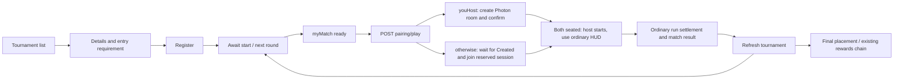

# MultiplayerUnityContract.md

# Multiplayer — Unity integration contract

Everything the Unity client needs to drive multiplayer against the Share7 backend without reading
backend code. The design behind it is [MultiplayerPlatform.md](MultiplayerPlatform.md).

**Status of each part:**

| Part | Status |
|---|---|
| §2–§5 Sessions, matchmaking, heartbeat, host transfer | **Live.** The shipped build uses these; `Contracts/Snapshots/multiplayer.json` is the byte-exact reference. |
| §6 Join by code, §6.1 Remove a player | **Live, new** (2026-09-30). Additive; the shipped build does not call them. |
| §6.2 Match result, §6.3 attempts naming the session | **Live, new** (2026-09-30). Additive; the shipped build does not call them. |
| §6.4 Join-code rotation, §6.5 Rematch, §6.6 Photon authentication | **Live, new** (2026-10-01). Additive; the shipped build does not call them. §6.6 changes nothing until Photon custom authentication is switched on in the Photon dashboard. |
| §11 Social: event feed, play-with list, invites, challenges, friends, parties, blocks | **Live, new** (2026-10-01). Additive; the shipped build does not call them. |
| §12 Ranked: tickets, rated matches, seasonal ranks | **Live, new** (2026-10-01). Additive; the shipped build does not call them, and its `isRanked` flag keeps meaning only what it meant. |
| §9 Client obligations | **Required** of every build, including the one being written now. |
| §10 Future contracts | Mostly built now — each entry points at its section. What remains is designed, not built. |

Changes since the shipped build, all additive or value-only:

1. `players[].displayName` is the player's **generated public handle** (e.g. `SwiftFalcon418`), no
   longer their profile name. Same field, type and nullability.
2. `curriculumPath.lessonId` is filled in with the lesson the server chose when a session was
   matched by subject (the client sent a subject and no lesson). Exact-lesson sessions are unchanged.
3. `POST /api/multiplayer/sessions/join-by-code`.
4. `POST /api/multiplayer/sessions/{id}/remove`, and the refusal `SESSION_REMOVED`.
5. `GET /api/multiplayer/sessions/{id}/result` — the server's verdict on a match (§6.2).
6. `POST /api/progress/attempts` accepts an optional `sessionId` (§6.3); game-mode reads carry the
   mode's `winRule`.
7. `POST /api/multiplayer/sessions/{id}/join-code/rotate` (§6.4).
8. `POST /api/multiplayer/sessions/{id}/rematch` and the refusal `SESSION_RESERVED` (§6.5).
9. `POST /api/multiplayer/transport/ticket`, and Photon's callback `/api/multiplayer/transport/photon-auth` (§6.6).
10. The social layer (§11): `GET /api/multiplayer/events` (the player feed), `/api/social/*` (play-with list, friends, blocks), invites, challenges and parties under `/api/multiplayer`.
11. Ranked and queued matchmaking (§12): `/api/multiplayer/tickets`, `/api/multiplayer/ranked/{modeId}/standing`, game modes carry `ranked`, and the match result carries the caller's `ranked` outcome.

---

## 1. Conventions

- **Base path** `/api/multiplayer`. Every route requires `Authorization: Bearer <access token>`;
  without one: `401`, empty body. (Photon's callback, §6.6, is the one exception — Photon calls it,
  never the client.)
- **Identity is the token.** No request carries your user id. `toUserId` (host transfer) names a
  *target*, never the caller.
- **JSON is camelCase.** Optional fields may be omitted. Unknown fields in responses must be ignored.
- **Enums on the wire are PascalCase strings**: `"Created"`, `"Connected"`, `"Public"`, `"Joined"`.
  Parse case-insensitively and map unknown values to an `Unknown` case — never throw.
- **Timestamps** are ISO-8601 UTC with `Z`. **Never compare them to the device clock**; compare to
  `serverTimeUtc`, which is on every session and heartbeat response.
- **`requestId`** (optional, ≤ 128 chars) on every mutating call is the idempotency key:
  **mint one per user intention and reuse it for every retry of that intention.** A completed
  operation retried with the same key returns the original response (same session, same outcome).
  A *refused* operation does not spend its key: retry the same key when the condition clears
  (e.g. after `SESSION_FULL`). Never reuse a key across two different intentions.
- **Protocol version** (`protocolVersion`) is the realtime contract version, not the app version.
  Currently accepted: `[1]` (server config). Send it on create, join, join-by-code and matchmake.

### 1.1 Errors

Refusals use the envelope:

```json
{ "code": "SESSION_FULL", "messageKey": "multiplayer.session.full", "details": { "currentPlayerCount": 2, "maxPlayers": 2 } }
```

**Map on `code`. Localise with `messageKey`. Never parse message text.** HTTP status by kind:
`400` validation · `403` forbidden · `404` not found · `409` conflict · `422` unprocessable.

Two responses do **not** carry the envelope: `401` (empty body → re-authenticate) and a `400` from
request-shape validation (e.g. a `requestId` longer than 128) which is ASP.NET's
`{ "title", "errors": {…} }` — treat any `400` without `code` as `VALIDATION_FAILED`.
`429` carries `RATE_LIMITED` with `details.retryAfterSeconds` and a `Retry-After` header.

| `code` | HTTP | Meaning | Client response |
|---|---|---|---|
| `SESSION_NOT_FOUND` | 404 | No such session, or you have never held a seat in it. Also: an unknown/ended/malformed join code. | Leave the flow; "room not found". |
| `SESSION_FULL` | 409 | No free seat. | Offer retry (same `requestId`) or matchmake. |
| `SESSION_CLOSED` | 409 | Not accepting players. `details.state` / `details.closedReason` in **stored form** (`"RUNNING"`, `"HOST_CLOSED"`). | "Match already started/ended". |
| `ALREADY_IN_SESSION` | 409 | You already hold a live seat somewhere. | Call `GET /sessions` and resume or leave that session. |
| `SESSION_REMOVED` | 403 | The host removed you from this session; you cannot take a seat in it again. | "The host removed you from this room." Return to the menu. |
| `SESSION_RESERVED` | 403 | The room is a rematch held for the players of the match before it, and you were not one. | "This room is saved for other players." Return to the menu. |
| `SOCIAL_NOT_ALLOWED` | 403 | Not a classmate or friend — or a block, which is never told apart. | "You can only play with classmates and friends." |
| `SOCIAL_CONSENT_REQUIRED` | 403 | Friends need a parent's consent for players under 18. | "Ask a parent to turn on playing with friends." Classmates still work. |
| `INVITE_NOT_FOUND`, `CHALLENGE_NOT_FOUND`, `FRIEND_REQUEST_NOT_FOUND`, `PARTY_NOT_FOUND` | 404 | Gone, or never yours. | Remove the card. |
| `INVITE_NOT_PENDING`, `CHALLENGE_NOT_OPEN`, `FRIEND_REQUEST_NOT_PENDING` | 409 | Already answered, withdrawn or expired; `details.state` says which. | Remove the card. |
| `FRIEND_CODE_NOT_FOUND` | 404 | No player can be added with that code. | "That code didn't work." Never say why. |
| `CHALLENGE_NO_SCORE`, `CHALLENGE_LESSON_LOCKED` | 409 | You have no score on the lesson yet / they cannot play it yet. | Say so plainly. |
| `PARTY_FULL`, `NOT_PARTY_LEADER`, `PARTY_MEMBER_BUSY` | 409 · 403 · 409 | As named; `PARTY_MEMBER_BUSY` lists `details.userIds`. | Show who is still in a room. |
| `EVENTS_CURSOR_EXPIRED` | 410 | The feed cursor is older than retention. | Re-read state; continue from `details.latest`. |
| `RANKED_SOLO_ONLY`, `MODE_NOT_RANKED` | 409 | Ranked is solo, and only in a ranked mode. | Hide ranked for parties; refresh modes. |
| `TICKET_NOT_FOUND`, `TICKET_NOT_SEARCHING` | 404 · 409 | No ticket, or it already matched or ended. | Re-read `/tickets/current`. |
| `NOT_SESSION_MEMBER` | 403 | Host transfer named someone without a seat. | Re-read the roster. |
| `NOT_SESSION_HOST` | 403 | Only the current host may do this. On heartbeat: **you lost host.** | Become a member; stop heartbeating. |
| `SESSION_INVALID_TRANSITION` | 409 | Not legal from the current state. | Re-read the session and follow its state. |
| `SESSION_BELOW_MIN_PLAYERS` | 409 | Start refused; `details.currentPlayerCount`, `details.minPlayers`. | Keep waiting. |
| `TRANSPORT_NAME_TAKEN` | 409 | Room name in use by a live session. | Mint a new room name, **new** `requestId`. |
| `HOST_STILL_ACTIVE` | 409 | Claim refused: host inside grace (`details.hostLastSeenAtUtc`, `details.hostClaimGraceSeconds`) or another claim won (`details.hostUserId`). | Wait / follow the winner. Do not retry in a loop. |
| `PROTOCOL_VERSION_MISMATCH` | 400 | `details.requested`, `details.accepted`. | "Update required". |
| `GAME_NOT_FOUND` | 404 | Unknown `gameId`. | Bug. |
| `GAME_NOT_MULTIPLAYER` | 409 | Game not flagged multiplayer. | Hide multiplayer for it. |
| `PC_NO_SHARED_LESSON` | 409 | Subject match: you have nothing unlocked with questions in this subject (create), or no lesson in common (seat — matchmaking absorbs this and tries elsewhere). | "Unlock a lesson first". |
| `PC_MODE_UNKNOWN`, `PC_MODE_WRONG_GAME`, `PC_MODE_INACTIVE`, `PC_MODE_NOT_ENTITLED`, `PC_MODE_GRADE_GATED`, `PC_TOPOLOGY_MISMATCH`, `PC_CONTEXT_INVALID`, `PC_EVENT_UNKNOWN`, `PC_EVENT_CLOSED`, `PC_EVENT_NOT_ELIGIBLE`, `PC_EVENT_ENTRY_LIMIT`, `PC_EVENT_MODE_MISMATCH` | 400/403/409 | The mode/event you asked for cannot be played now, by you, with this many seats. | Refresh the mode/event list; hide the option. |
| `VALIDATION_FAILED` | 400 | e.g. missing `transportSessionName`. | Bug. |
| `RATE_LIMITED` | 429 | Too many calls. | Back off `retryAfterSeconds`. |

### 1.2 Retry policy

| Situation | Do |
|---|---|
| Timeout / connection error / 5xx on a mutating call | Retry with the **same** `requestId`, exponential backoff (1 s, 2 s, 4 s, cap 15 s). |
| `ALREADY_IN_SESSION` after a retry | Your earlier attempt probably succeeded: `GET /sessions` and resume. |
| `429` | Wait `retryAfterSeconds`. |
| Any other 4xx | Do not retry blindly; follow the table above. |
| Heartbeat failure | Keep heartbeating on schedule; the match continues on Photon. The server tolerates silence for `SessionTimeoutSeconds` (60 s) and, after a server restart, a further full window. |

---

## 2. Shapes

### 2.1 `MultiplayerSessionDto` — returned by create, start, join, join-by-code, leave, close, host-transfer, get, list, matchmake

```jsonc
{
  "id": "uuid",
  "gameId": "uuid",
  "hostUserId": "uuid",
  "transportSessionName": "r7f3a91c",        // the Photon room name
  "transportRegion": "eu",                    // null = best region
  "joinCode": "K3F9QA",                       // private sessions only, else null
  "state": "Created",                         // §3.1
  "visibility": "Public",                     // "Public" | "Private"
  "maxPlayers": 2,
  "minPlayers": 1,
  "currentPlayerCount": 2,
  "protocolVersion": 1,
  "isRanked": false,
  "curriculumPath": {                         // null if none was sent
    "gradeId": "uuid|null", "termId": "uuid|null", "subjectId": "uuid|null",
    "chapterId": "uuid|null",
    "lessonId": "uuid|null"                   // the lesson this match PLAYS — see §4.2
  },
  "createdAtUtc": "2026-09-30T10:00:00Z",
  "startedAtUtc": null,
  "endedAtUtc": null,
  "serverTimeUtc": "2026-09-30T10:00:03Z",
  "players": [ /* §2.2, seated players only, ordered by slot */ ]
}
```

### 2.2 `MultiplayerSessionPlayerDto`

```jsonc
{
  "userId": "uuid",
  "displayName": "SwiftFalcon418",   // public handle; null → show your own placeholder
  "slot": 0,                          // stable for the seat's life; render seats in this order
  "isHost": true,
  "status": "Connected",              // §3.2
  "joinedAtUtc": "…Z",
  "lastSeenAtUtc": "…Z"
}
```

**`displayName` is a generated handle, never a real name.** Do not display `userId`.

### 2.3 Others

```jsonc
// HeartbeatResponse
{ "state": "Running", "serverTimeUtc": "…Z", "nextHeartbeatInSeconds": 15, "players": [ … ] }

// MatchmakeResponse
{ "outcome": "Joined" | "Created" | "NoMatch", "session": { /* §2.1, null only for NoMatch */ } }
```

---

## 3. State machines (mirror these; the server is authoritative)

### 3.1 Session

```
Creating ──confirm──► Created ──start──► Running ──► (Ending ──► Closing) ──► Closed
    │                    │                  │
    └── 30 s, no confirm ► Failed            └── any live state ──host close / last leave──► Closed
any live state ── 60 s without host heartbeat (sweeper) ──► Abandoned
```

| State | Joinable | Heartbeat | UI |
|---|---|---|---|
| `Creating` | no | no | "Setting up the room…" — bring the Photon room up, then call **start** once to confirm |
| `Created` | **yes** | **yes** | Lobby: roster, waiting, host's Start button |
| `Starting` | no | yes | (transient; the API goes straight to `Running`) |
| `Running` | no | yes | In match |
| `Ending` / `Closing` | no | yes / no | (reserved; not produced by the API today) |
| `Closed` | no | no | Match over — `closedReason` visible to admins only |
| `Failed` | no | no | "Couldn't create the room" |
| `Abandoned` | no | no | "Connection to the match was lost" → **tear down** |

`Starting`, `Ending` and `Closing` are legal states the API does not currently produce; handle them
as "in match".

### 3.2 Seat

```
Joined ──seen on host roster──► Connected ──missing 45 s (host heartbeat)──► Disconnected
  │                                ▲                                            │
  └── never seen for 60 s ─────────┼──────────────────────────► Disconnected    │
                                   └──────────── seen again ────────────────────┘
Disconnected ──45 s more (sweeper)──► Left      leave / session ends ──► Left
```

A `Disconnected` player **keeps their seat** — show "reconnecting…". Only `Left`/`Removed` free it;
departed seats do not appear in `players`.

---

## 4. Flows

### 4.1 Matchmake (quick play / subject / lesson)

```
POST /api/multiplayer/matchmaking
{
  "gameId": "uuid",
  "protocolVersion": 1,
  "modeKey": "runner.mode.classic",      // optional; default mode when absent
  "eventId": "uuid",                     // optional; match only inside this event
  "isRanked": false,
  "maxPlayers": 2,                       // optional; clamped to the game's maximum
  "curriculumPath": { "subjectId": "uuid" },  // subject match — or { "lessonId": "uuid" } for exact lesson
  "createIfNoneFound": true,
  "transportSessionName": "r7f3a91c",    // required when createIfNoneFound; the room YOU would host
  "transportRegion": "eu",
  "requestId": "mm-…"
}
```

`200` with `outcome`:

- **`Joined`** — you were seated in someone else's `Created` session. Join Photon room
  `session.transportSessionName`. You are a member, not the host.
- **`Created`** — nothing suitable; a new public session exists with **you as host** in `Creating`.
  Create Photon room `transportSessionName`, then `POST /sessions/{id}/start` to open it for joins,
  then heartbeat.
- **`NoMatch`** — only when `createIfNoneFound: false`.

Mint `transportSessionName` fresh per matchmake intention (e.g. 8 random base-36 chars) and keep it
with the `requestId`: a retry must send **both unchanged**.

### 4.2 Which lesson the match plays

Read `session.curriculumPath.lessonId`:

- Exact-lesson match: the lesson you sent.
- Subject match: `null` while the roster is forming; **set by the server** once enough players are
  seated (or when the host starts alone). It is the shared lesson the group is least practised at.
  Re-read it from the join/matchmake/start/get response — do not pick your own.

### 4.3 Host a room directly (friends)

```
POST /api/multiplayer/sessions
{ "gameId": "uuid", "transportSessionName": "r7f3a91c", "transportRegion": "eu",
  "visibility": "Private", "maxPlayers": 4, "isRanked": false, "protocolVersion": 1,
  "modeKey": "…", "eventId": null, "curriculumPath": { … }, "requestId": "…" }
```

`201` → session in `Creating` with `joinCode` (private only). Bring up the Photon room (for a private
session set the Photon room **invisible** in the lobby), then `POST /sessions/{id}/start` with no
body fields besides `requestId` → `Created`. Show the code (and a QR/deep link of it,
`share7://join/K3F9QA`).

### 4.4 Heartbeat (host only)

```
POST /api/multiplayer/sessions/{id}/heartbeat
{ "connectedUserIds": ["uuid", …],   // user ids of peers in your Photon room (include yourself or not)
  "state": "Running" }               // optional, your view; logged only
```

Every `nextHeartbeatInSeconds` (use the server's value, not a constant). The response `state` **is
authoritative**: `Abandoned`/`Closed`/`Failed` → tear down. `403 NOT_SESSION_HOST` → you are no longer
host (a member claimed it); continue as a member.

### 4.5 Start the match (host only)

`POST /sessions/{id}/start` in `Created` → `Running`. `SESSION_BELOW_MIN_PLAYERS` → keep waiting.
Then every client opens its own run: `POST /api/runs/start { gameId, modeKey, sessionId, … }` and
settles it: `POST /api/runs/{runId}/result`. **The run must name the session**, and only a seated
player's run is treated as networked. A quiz-style match also submits its graded attempt with the
session id (§6.3). When the match ends, show the results screen from `GET /sessions/{id}/result`
(§6.2) — never from anything a client decided.

### 4.6 Leave / close

- Member: `POST /sessions/{id}/leave` — idempotent; safe to call on every exit path.
- Host leaving: authority passes to the lowest connected seat automatically; last one out closes
  the session as `Empty`.
- Host ending the match for everyone: `POST /sessions/{id}/close { "reason": "HostClosed" }`.
  Idempotent; a closed session stays closed on its original terms.

### 4.7 Host migration

When Photon makes you the new authority (`OnHostMigration` / state authority acquired):

```
POST /sessions/{id}/host-transfer { "toUserId": "<your id>", "reason": "HostUnreachable", "requestId": "…" }
```

Accepted once the old host has been silent `HostClaimGraceSeconds` (30 s). `HOST_STILL_ACTIVE` with
`details.hostUserId` → someone else won; follow them. Voluntary hand-over by the current host: same
call with the target's id and `"Voluntary"`.

### 4.8 Recovery after crash / reinstall / `ALREADY_IN_SESSION`

`GET /api/multiplayer/sessions` → sessions you hold a live seat in (usually 0 or 1). Resume it
(rejoin the Photon room by `transportSessionName`) or leave it.

---

## 5. Route reference

| Method | Route | Body | Success | Refusals |
|---|---|---|---|---|
| POST | `/sessions` | §4.3 | `201` session (`Creating`) | `GAME_NOT_FOUND`, `GAME_NOT_MULTIPLAYER`, `ALREADY_IN_SESSION`, `TRANSPORT_NAME_TAKEN`, `PROTOCOL_VERSION_MISMATCH`, `PC_*`, `VALIDATION_FAILED` |
| POST | `/sessions/{id}/start` | `{ requestId }` | `200` session | `SESSION_NOT_FOUND`, `NOT_SESSION_HOST`, `SESSION_INVALID_TRANSITION`, `SESSION_BELOW_MIN_PLAYERS` |
| POST | `/sessions/{id}/join` | `{ protocolVersion, requestId }` | `200` session | `SESSION_NOT_FOUND`, `SESSION_FULL`, `SESSION_CLOSED`, `SESSION_REMOVED`, `SESSION_RESERVED`, `ALREADY_IN_SESSION`, `PROTOCOL_VERSION_MISMATCH`, `PC_NO_SHARED_LESSON` |
| POST | `/sessions/join-by-code` | §6 | `200` session | as join; every unusable code is `SESSION_NOT_FOUND` |
| POST | `/sessions/{id}/leave` | `{ requestId }` | `200` session | `SESSION_NOT_FOUND` |
| POST | `/sessions/{id}/remove` | `{ userId, requestId }` | `200` session | `SESSION_NOT_FOUND`, `NOT_SESSION_HOST`, `NOT_SESSION_MEMBER`, `SESSION_INVALID_TRANSITION`, `SESSION_CLOSED`, `VALIDATION_FAILED` |
| POST | `/sessions/{id}/close` | `{ reason?, requestId }` | `200` session | `SESSION_NOT_FOUND`, `NOT_SESSION_HOST` |
| POST | `/sessions/{id}/heartbeat` | §4.4 | `200` heartbeat | `SESSION_NOT_FOUND`, `NOT_SESSION_HOST` |
| POST | `/sessions/{id}/host-transfer` | `{ toUserId, reason, requestId }` | `200` session | `SESSION_NOT_FOUND`, `SESSION_CLOSED`, `NOT_SESSION_MEMBER`, `NOT_SESSION_HOST`, `HOST_STILL_ACTIVE` |
| POST | `/matchmaking` | §4.1 | `200` matchmake | as create + join |
| GET | `/sessions/{id}` | — | `200` session | `SESSION_NOT_FOUND` |
| GET | `/sessions/{id}/players` | — | `200` player[] | `SESSION_NOT_FOUND` |
| GET | `/sessions/{id}/result` | — | `200` result (§6.2) | `SESSION_NOT_FOUND` (never seated, or removed) |
| POST | `/sessions/{id}/join-code/rotate` | `{ requestId }` | `200` session (new `joinCode`) | `SESSION_NOT_FOUND`, `NOT_SESSION_HOST`, `SESSION_INVALID_TRANSITION`, `SESSION_CLOSED`, `VALIDATION_FAILED` (public session) |
| POST | `/sessions/{id}/rematch` | §6.5 | `200` session (the rematch) | `SESSION_NOT_FOUND`, `NOT_SESSION_MEMBER`, `SESSION_INVALID_TRANSITION`, and every create refusal |
| POST | `/transport/ticket` | — | `200` ticket (§6.6) | `FORBIDDEN` (locked account) |
| GET | `/sessions?gameId&state&visibility&isRanked&lessonId` | — | `200` session[] (yours) | — |

Rate limits: mutating routes 60/min/user (heartbeat and reads only the 240/min global);
join-by-code 10/min/user.

---

## 6. Join by code (new)

```
POST /api/multiplayer/sessions/join-by-code
{ "joinCode": "k3f 9qa", "protocolVersion": 1, "requestId": "…" }
```

- The code goes **in the body**, never in a URL. Case, spaces and hyphens are ignored.
- `200` → seated, exactly as a join; join Photon room `transportSessionName`.
- `SESSION_NOT_FOUND` for any code that opens nothing — show one message ("That code didn't work —
  check it with your friend"), never distinguish.
- A session in `Creating` is not yet joinable (`SESSION_CLOSED`): tell the friend to wait a moment.
- **Rollout:** once this client ships, the server will switch on
  `RequireJoinCodeForPrivateSessions`, after which a private session cannot be joined **by id** by
  anyone who has not already held a seat in it. Reconnecting players keep the by-id route.

### 6.1 Remove a player (host, before the match)

```
POST /api/multiplayer/sessions/{id}/remove
{ "userId": "<the player's userId from players[]>", "requestId": "…" }
```

- Host only, and only while the session is `Creating` or `Created`. In a running match the host's
  option is `close`.
- `200` → the updated session without that seat. **Then disconnect that peer from the Photon room** —
  the backend cannot, and a removed player's seat no longer exists (§9.1 would remove them on the next
  reconciliation anyway).
- The removed player: every later join of this session — by id, by code, through matchmaking — is
  refused `SESSION_REMOVED`; reads of it answer `SESSION_NOT_FOUND`. Matchmaking will not offer it
  to them again.
- Idempotent: removing someone twice, or someone who already left, succeeds and keeps them out.
- UI: an explicit "Remove from room" on each seat in the host's lobby, with a confirmation. Pair it
  with a local mute for reactions.

### 6.2 Match result (who won — decided by the server)

```
GET /api/multiplayer/sessions/{id}/result
→ 200 {
  "sessionId": "…", "state": "Decided", "decidedBy": "all_reported", "decidedAtUtc": "…Z",
  "rule": [ { "metric": "outcome",     "order": "higher", "trust": "reported" },
            { "metric": "signal:kill", "order": "higher", "trust": "bounded" } ],
  "placements": [
    { "slot": 2, "userId": "…", "displayName": "SwiftFalcon418", "placement": 1, "isWinner": true,
      "reported": true, "forfeited": false, "flagged": false,
      "values": { "outcome": 1, "signal:kill": 7 } },
    { "slot": 1, "userId": "…", "displayName": "CalmOtter902",   "placement": 2, "isWinner": false,
      "reported": true, "forfeited": false, "flagged": false,
      "values": { "outcome": 0, "signal:kill": 9 } } ],
  "serverTimeUtc": "…Z" }
```

- **What decides a match is the mode's win rule**, authored per mode in the console (e.g. "finished
  or survived, then most kills, then longest alive"; or "most correct answers, then fastest"). The
  same rule is on the mode itself (`winRule` in the game-mode read), so the lobby can show "How to
  win" before the match. Render the rule; never hard-code one per game.
- `state`: `Pending` → poll every 3–5 s on the results screen (counts `reported` for a "waiting for
  2 players" line). `Decided` → placements are final. `Unranked` → the mode has no rule: show who
  played, crown nobody. `Void` is reserved for an operator voiding a match (no route sets it yet); treat it like `Unranked`.
- A match is decided as soon as everyone has reported, or 120 s after it ended — anyone still
  missing then has `forfeited: true` and is placed last.
- `placement`: 1 is first; **ties share a placement** (1, 1, 3), and everyone with `isWinner` won.
  `flagged: true` means that player reported more than their time played allows — they are placed
  below every clean player; say "result under review", never "cheater".
- `values` are keyed by metric: `correct_answers` (count), `accuracy` (whole percent 0–100),
  `duration_ms`, `outcome` (1 = finished/survived), `signal:<kind>` (count).
- Members only: anyone who held a seat, except a player the host removed.
- Nothing the client sends can change this. **Report the match through your run** (`outcome`,
  `durationMs`, `pickups` with the signal kinds) and, for questions, through the attempt (§6.3).

### 6.3 Attempts played inside a match

`POST /api/progress/attempts` takes an optional `"sessionId": "…"`. Send it for the graded attempt a
player makes *during* a match. The server credits `correct_answers` / `accuracy` from its own grading
of the **first** attempt each seated player submits on the match's lesson after the match started;
anything else (not seated, other lesson, before start) is graded as usual and simply does not count
toward the match. Omitting it keeps today's behaviour exactly.

### 6.4 Rotate a private room's join code (host, before the match)

```
POST /api/multiplayer/sessions/{id}/join-code/rotate
{ "requestId": "…" }
→ 200 session, with a new "joinCode"
```

- For a host who thinks the code reached the wrong person. The old code opens nothing from then on
  (`SESSION_NOT_FOUND`, like any unknown code).
- Players already seated keep their seats — pair it with **Remove** (§6.1) for anyone who got in.
- A retry with the same `requestId` returns the same new code. Show the new code in the lobby at once.
- Only in `Creating`/`Created`, only for private sessions (`VALIDATION_FAILED` on a public one).

### 6.5 Rematch (any player of an ended match)

```
POST /api/multiplayer/sessions/{endedId}/rematch
{ "transportSessionName": "<a fresh Photon room name>", "transportRegion": "eu",
  "protocolVersion": 1, "requestId": "…" }
→ 200 session (the rematch)
```

- Offer "Rematch" on the results screen once the match has **ended** (host closed it, or it was
  swept). A match that never started, or is still running, answers `SESSION_INVALID_TRANSITION`.
- The rematch is a new **private** session: same game, mode, event and curriculum, never ranked, and
  **reserved** for the players who were in the match at kick-off. Nobody else can take a seat
  (`SESSION_RESERVED`), by id or by code.
- **If `hostUserId` is you**, you asked first: you host it, it is in `Creating` — bring up the Photon
  room under the `transportSessionName` you sent, then `start`, exactly as after a create (§4.3).
- **If not**, someone asked first: do not create your room. Poll `GET /sessions/{id}` every 2–3 s
  until `Created`, then `join` by id — reserved players may read and join it even before holding a
  seat, and even once join codes are required for private rooms. Give up after ~30 s (the host never
  brought it up; it will be `Failed`) and let the player ask again — a failed rematch can be retried.
- Two players pressing at once still get **one** room: the server keeps one live rematch per match.
- A subject match rematches on its subject (the lesson may differ); an exact-lesson match replays
  its lesson.

### 6.6 Photon custom authentication

Only a signed-in Share7 account should be able to connect to Photon at all (today, anyone who knows a
room name can join the room itself). Before connecting:

```
POST /api/multiplayer/transport/ticket          (Authorization: Bearer <access token>)
→ 200 { "ticket": "…", "expiresAtUtc": "…Z", "provider": "photon" }
```

Then connect with custom auth values: `AuthType = Custom`, parameter `ticket=<ticket>` (query
parameter, or post data `{ "ticket": "…" }`). Photon asks the backend; on success Photon sets the
peer's **`UserId` to the Share7 user id** and its **`NickName` to the player's public handle**.

- Fetch a **fresh ticket before every connect** (it lasts two minutes). Photon's own reconnect
  normally reuses the token Photon issued at the first connect; if a reconnect is refused
  authentication, fetch a new ticket and connect again.
- Never send the access token to Photon. The ticket is useless anywhere else — every API route
  refuses it.
- Create rooms with `PublishUserId = true`, so the host can match every peer's `UserId` against
  `players[].userId` (§9.1) instead of trusting anything a client says about itself.
- A refusal surfaces as Photon's custom-authentication failure: re-fetch a ticket once; if it fails
  again, the account cannot play multiplayer right now ("Multiplayer isn't available on this account").
- **Rollout:** ship the client that sends tickets first, with Photon's "allow anonymous clients"
  still on, so the current build keeps connecting; operations turn anonymous access off once the
  old build is retired.

---

## 7. UX states the backend can put you in

| UX state | Trigger |
|---|---|
| Loading | any call in flight |
| Searching | matchmake in flight (typically < 1 s) → then lobby |
| Waiting for players (you host) | outcome `Created`, state `Created`, `currentPlayerCount < maxPlayers` |
| Empty | lobby with only you |
| Full | `currentPlayerCount == maxPlayers` |
| Failed | any refusal in §1.1 |
| Reconnecting | your seat `Disconnected`, or heartbeat failing while Photon is fine |
| Cancelled | you called leave; or `SESSION_CLOSED` on join |
| Expired | session `Failed` (room never confirmed) or `Abandoned` |
| Removed by host | `SESSION_REMOVED` on rejoin; `SESSION_NOT_FOUND` on reads; the Photon host disconnects you |
| Waiting for results | `GET /sessions/{id}/result` → `Pending` (§6.2) |
| Waiting for the rematch room | rematch answered with someone else as `hostUserId`, state `Creating` (§6.5) |
| Reserved for others | `SESSION_RESERVED` on join (§6.5) |
| Banned / not allowed | `PC_MODE_NOT_ENTITLED`, `PC_MODE_GRADE_GATED`, `PC_EVENT_NOT_ELIGIBLE` |
| Match found | outcome `Joined` |
| Match cancelled | host closed before start (`Closed`) |
| Update required | `PROTOCOL_VERSION_MISMATCH` |

---

## 8. Realtime events — who delivers what, today

Inside a room, events travel over **Photon** between the clients in it. Outside any room they arrive
on **the player feed** (§11.1) — a long-poll, not a socket; a push accelerator can come later without
changing it. State is always re-readable by polling the backend.

| Event | Source today | How |
|---|---|---|
| PlayerJoined / PlayerLeft / PlayerDisconnected / PlayerReconnected | Photon callbacks | authoritative for presence in the room |
| RosterChanged (server's view) | backend | every heartbeat response (host), `GET /sessions/{id}` (others) |
| HostChanged | Photon + backend | host-transfer response; members see `hostUserId` change on next read |
| MatchStarting | host | Photon RPC after `start` returns `Running` |
| MatchCancelled / SessionEnded | backend | heartbeat/GET `state` terminal |
| ReactionSent / EmojiSent | Photon RPC | curated set only — `Wave, Laugh, Fire, GoodGame, Nice, Wow, Rematch, Ready`; ≥ 2 s apart per sender; the host drops faster ones; a player may mute a seat locally. **No free text.** |
| InviteReceived / ChallengeReceived / PartyUpdated / ResultReady | backend | **the player feed** (§11.1), by long-poll — outside any room |
| MatchFound (ticket) | — | not available yet (tickets, P3) |

Reaction payload over Photon: `{ "v": 1, "kind": "GoodGame", "fromSlot": 1, "clientSeq": 42 }` —
versioned, slot-addressed (never user ids), deduplicated by `(fromSlot, clientSeq)`.

---

## 9. Client obligations (security-relevant — required)

1. **The host must enforce the backend roster in the Photon room.** On each heartbeat response and on
   every Photon join, compare Photon peers to `players[].userId`; **disconnect any peer without a
   seat.** A Photon room name is all anyone needs to join the room itself; the backend's seat is the
   authority, and only the host can apply it. With custom authentication on (§6.6), a peer's Photon
   `UserId` *is* its Share7 user id — compare those, never a nickname or custom property.
2. Private sessions: create the Photon room **invisible** in Photon's lobby.
3. Never display `userId`; display `displayName` (handle).
4. Never send a winner or placement to the backend as a claim; send runs (`/api/runs`) and attempts,
   and show the server's verdict (§6.2).
5. Reuse `requestId` for retries; mint new for new intentions.
6. Mirror the state machines; on any disagreement, the server's state wins.

---

## 10. Future contracts

### 10.1 Player event feed

**Built** — see §11.1. Still to come: `multiplayer.matchmaking.match_found`, with tickets (P3).

### 10.2 Rematch

**Built** — see §6.5.

### 10.3 Match result

**Built** — see §6.2. A rated match also carries the caller's own `ranked` outcome (§12.3). A
per-placement `ratingDelta` was planned and deliberately not built: the skill rating stays hidden, and
the visible rank is what a player sees move.

### 10.4 Photon custom authentication

**Built** — see §6.6. (Designed first around the access token; built around a two-minute ticket
instead, so nothing that passes through Photon's servers can call the API.)

### 10.5 v2 roster (privacy)

Per-session `seatRef` instead of `userId`/`hostUserId` on the wire, selected by protocol version.
Planned; will not change v1.

---

## 11. Social (Phase 2)

**Who may reach whom** is decided in one place on the server and is the same for every feature
below: two players are connected when they are **classmates** (learners in the same active class of
an active school) or **friends** (§11.5). Never a stranger met in a public match. A **block** in either
direction overrides everything, and every refusal a block causes is indistinguishable from "not
connected" (`SOCIAL_NOT_ALLOWED`). Names are always the public handle; real names are never sent.

### 11.1 The player feed

```
GET /api/multiplayer/events?after={sequence}&wait=25
→ 200 { "events": [ { "sequence": 1843, "eventId": "uuid", "type": "multiplayer.invite.received",
                      "version": 1, "occurredAtUtc": "…Z", "expiresAtUtc": "…Z", "payload": { … } } ],
        "nextAfter": 1843, "serverTimeUtc": "…Z" }
```

- Keep **one** long-poll running while the app is open: send the last `nextAfter` you processed
  (start from `0`), handle the events, repeat. It answers at once when something is waiting, else
  within `wait` seconds (max 25). Persist `nextAfter`.
- **At least once, in order.** De-duplicate by `eventId`. Ignore types you do not know.
- `410 EVENTS_CURSOR_EXPIRED`: you were away longer than the 7-day retention. Re-read state
  (`GET /invites`, `GET /challenges`, `GET /parties/current`, `GET /sessions`) and continue from
  `details.latest`.
- **This poll is also presence**: a player whose client is polling shows as online to classmates and
  friends. Stop polling when the app is backgrounded.
- Events past `expiresAtUtc` are not delivered.

| Type | Payload | Show |
|---|---|---|
| `multiplayer.invite.received` | `invitationId, sessionId, gameId, modeId, fromUserId, fromDisplayName, expiresAtUtc, kind` (`invite` or `live_challenge`) | an invite card |
| `multiplayer.invite.cancelled` | `invitationId, sessionId` | remove the card |
| `multiplayer.invite.accepted` | `invitationId, sessionId, byUserId, byDisplayName` (to the sender) | "X is coming" |
| `multiplayer.match.result_ready` | `sessionId, state, placement, isWinner, forfeited` | fetch §6.2, show the results |
| `multiplayer.challenge.received` | `challengeId, fromUserId, fromDisplayName, gameId, lessonId, barPercent, deadlineUtc` | a challenge card |
| `multiplayer.challenge.accepted` | `challengeId, byUserId, byDisplayName` (to the challenger) | "X took you on" |
| `multiplayer.challenge.cancelled` | `challengeId` | remove the card |
| `multiplayer.challenge.completed` | `challengeId, outcome, barPercent, recipientBestPercent, youWon` | the outcome |
| `social.friend_request.received` | `requestId, fromUserId, fromDisplayName` | a request card |
| `social.friend_request.accepted` | `requestId, byUserId, byDisplayName` | "you are now friends" |
| `multiplayer.party.invite_received` | `invitationId, partyId, fromUserId, fromDisplayName, expiresAtUtc` | a party invite |
| `multiplayer.party.updated` | `partyId, reason` (`joined`, `left`, `removed`, `leader_changed`), `userId` | re-read the party |
| `multiplayer.party.play_started` | `partyId, sessionId, gameId` | wait for `Created`, then join the room |

Declines are never announced to the sender, on purpose: a child does not need a notification that a
classmate said no.

### 11.2 Who can I play with

```
GET /api/social/connections
→ 200 [ { "userId": "…", "displayName": "SwiftFalcon418", "relation": "Classmate", "presence": "Online" } ]
```

`relation`: `Classmate` or `Friend`. `presence`: `Offline`, `Online`, `InLobby`, `InMatch`. Online
and in-lobby first. This list is the only way to find someone: there is no search, no suggestions,
and no discovery by name.

### 11.3 Invites into a room

- `POST /api/multiplayer/sessions/{id}/invites { "userId": "…" }` — any player seated in the room,
  before it starts. Inviting again returns the same pending invite. Invites last 10 minutes and end
  with the room.
- `GET /api/multiplayer/invites` — invites waiting for you (after a reinstall, or a 410).
- `POST /api/multiplayer/invites/{id}/accept { "protocolVersion": 1 }` → the session, exactly as a
  join; then join the Photon room. An invite gets past a private room's join-code rule; capacity,
  removals and reservations still apply.
- `POST /api/multiplayer/invites/{id}/decline` (silent), `POST …/{id}/cancel` (the sender withdraws).
- Refusals: `SOCIAL_NOT_ALLOWED`, `NOT_SESSION_MEMBER`, `SESSION_INVALID_TRANSITION`,
  `SESSION_RESERVED`, `SESSION_REMOVED`, `INVITE_NOT_FOUND`, `INVITE_NOT_PENDING` (`details.state`).

### 11.4 Challenges

**"Beat my score by Friday"** — works when the other player is offline, which is most of the time.

- `POST /api/multiplayer/challenges { "userId", "gameId", "lessonId", "days": 3 }` (1–7 days). The
  bar is **your best graded score on that lesson in that game** (`CHALLENGE_NO_SCORE`: play it
  first). They must be able to play it (`CHALLENGE_LESSON_LOCKED`). Sending again returns the open one.
- `POST /challenges/{id}/accept` (only attempts graded after this count), `…/decline` (silent),
  `…/cancel` (only before it is accepted). `GET /api/multiplayer/challenges` lists yours, sent and
  received, open and ended this week, with `youAre`, `barPercent` and `recipientBestPercent`.
- Decided by the server from graded attempts — **play the lesson normally**; nothing extra is sent.
  Beaten → `RecipientWon` within about half a minute. At the deadline: matched exactly → `Draw`,
  below → `ChallengerWon`, never attempted → `Expired` (nobody won). Challenges pay nothing.

**Live duel:** `POST /api/multiplayer/challenges/live { "userId", "gameId", "modeKey",
"transportSessionName", "protocolVersion", "requestId" }` → `{ session, invitation }` — a private
room reserved for the two of you, plus an invite whose `kind` is `live_challenge`. Bring the room up
and `start` it as after any create.

### 11.5 Friends by code

Friends need **consent**: a player under 18 (or whose age is unknown) needs a parent or guardian to
turn on playing with friends. Without it, every friend route answers `SOCIAL_CONSENT_REQUIRED` —
show "Ask a parent to turn on playing with friends"; classmates still work.

- `GET /api/social/friend-code` → `{ "code": "K3F9QA2M" }` — show it (and a QR) to someone you know.
  `POST /api/social/friend-code/rotate` for a code that went somewhere it should not.
- `POST /api/social/friends { "code": "…" }` → a friend request they must accept; if they had
  already asked you, you are friends at once. Every unusable code is `FRIEND_CODE_NOT_FOUND`.
  Limited to 10 a minute.
- `GET /api/social/friend-requests`, `POST …/{id}/accept`, `POST …/{id}/decline` (silent),
  `DELETE /api/social/friends/{userId}` (silent).
- A friendship stops working if either side's consent is withdrawn, and ends on a block.

### 11.6 Parties

A few classmates or friends who stay together between matches (up to 4).

- `POST /api/multiplayer/parties` — your party (created with you as leader if you have none).
  `GET /api/multiplayer/parties/current` → `{ id, leaderUserId, members: [ { userId, displayName,
  isLeader, presence } ], currentSessionId }`, or `PARTY_NOT_FOUND`.
- Leader: `POST /parties/{id}/invites { "userId" }`, `POST /parties/{id}/remove { "userId" }`.
  Everyone: `GET /parties/invites`, `POST /parties/invites/{id}/accept` (joining moves you out of any
  other party; `PARTY_FULL`), `…/decline`, `POST /parties/{id}/leave` (a leader leaving hands over to
  the longest-standing member; the last one out ends it).
- **Play together:** the leader calls `POST /parties/{id}/play` with a create's body; it opens a
  private room reserved for exactly the party and sends everyone else
  `multiplayer.party.play_started`. Members wait for `Created` and join by id. `PARTY_MEMBER_BUSY`
  (`details.userIds`) while anyone is still in another room.
- Parties do not queue into public matchmaking yet (that needs tickets, P3).

### 11.7 Blocks

- `POST /api/social/blocks { "userId" }`, `DELETE /api/social/blocks/{userId}`, `GET /api/social/blocks`.
- Either direction: never matched together, no invites, challenges, friend requests or presence
  between them; pending invites and requests between them are withdrawn and a friendship ends.
  **The blocked player is never told.** Offer "Block" on every roster, invite and challenge card.

---

## 12. Ranked and queued matchmaking (Phase 3)

**Ranked is a mode property, set by operators** (`ranked: true` on the game-mode read; only modes played
versus with a win rule can be ranked). A ranked match is one **the server formed from ranked tickets**.
The `isRanked` flag a client sends to `/matchmaking` or `/sessions` is a legacy partition and is never
rated — otherwise two friends could open a "ranked" room and trade wins.

### 12.1 Queue

```
POST /api/multiplayer/tickets
{ "gameId": "…", "modeKey": "…", "ranked": true, "protocolVersion": 1,
  "curriculumPath": { "subjectId": "…" }, "transportRegion": "eu", "requestId": "…" }
→ 200 { "id": "…", "state": "Searching", "ranked": true, "players": ["…"], "enqueuedAtUtc": "…Z",
        "expiresAtUtc": "…Z", … }
```

- Show "searching" with a cancel button: `POST /api/multiplayer/tickets/{id}/cancel`. Searching again
  returns the same ticket. Tickets search for up to 3 minutes.
- **Ranked is solo** (`RANKED_SOLO_ONLY` for a party) and needs a ranked mode (`MODE_NOT_RANKED`).
- **Parties queue casual**: the leader adds `"partyId"` with `"ranked": false`. The party is placed
  together — into an open public room with space for all of you, or, after ~10 s, into a new public
  room the party hosts that other players then fill.
- `GET /api/multiplayer/tickets/current` recovers the ticket — searching, or matched in the last 10
  minutes — after a reconnect.
- Refusals: `ALREADY_IN_SESSION`, `PARTY_MEMBER_BUSY` (`details.userIds`), `NOT_PARTY_LEADER`,
  `RANKED_SOLO_ONLY`, `MODE_NOT_RANKED`, `PROTOCOL_VERSION_MISMATCH`, `PC_NO_SHARED_LESSON`, `PC_*`.

### 12.2 Match found

The answer arrives on the feed:

| Event | Payload | Do |
|---|---|---|
| `multiplayer.matchmaking.match_found` | `ticketId, sessionId, hostUserId, youHost, transportSessionName, transportRegion, rated` | You are **already seated**. If `youHost`: create the Photon room named `transportSessionName`, then `POST /sessions/{id}/start` (Creating → Created). Otherwise: poll `GET /sessions/{id}` until `Created`, then join the Photon room. |
| `multiplayer.matchmaking.requeued` | `ticketId, reason: "host_no_show"` | The host never brought the room up; you are back in the queue, keeping your place. Show "searching" again. |
| `multiplayer.matchmaking.expired` | `ticketId` | Nothing suitable in 3 minutes. Offer casual play, a party room, or try again. |

Ranked matching widens with waiting: close skill first, anyone within about a minute. Players who
blocked each other are never matched.

### 12.3 Your rank

```
GET /api/multiplayer/ranked/{modeId}/standing
→ 200 { "seasonKey": "2026-10", "seasonEndsAtUtc": "…Z", "isPlacement": false, "placementMatchesLeft": 0,
        "tier": "silver", "division": 2, "matchesPlayed": 9, "wins": 5 }
```

- Tiers `bronze`, `silver`, `gold`, `platinum`, `diamond`; divisions 3 (lowest) to 1; diamond has none.
  **Localise and draw them yourself** — the keys are stable, the art is yours.
- Seasons are calendar months (UTC). The first **5 matches** are placements: no tier yet, show
  "placement match 3 of 5".
- **The tier is the season's best and never drops before the season ends.** Losing still moves the
  hidden skill rating (so opponents stay fair) — it is never shown.
- After each rated match: `multiplayer.ranked.updated` (`modeId, seasonKey, isPlacement,
  placementMatchesLeft, tier, division, promoted, notCountedReason`), and the result read (§6.2)
  carries `ranked` for you alone: `{ tier, division, isPlacement, placementMatchesLeft, promoted,
  notCountedReason }`. Celebrate `promoted`.
- `notCountedReason`: `walkover` (your opponent left, so nothing you did was tested) or
  `repeat_opponent` (you have played these players many times today). Say so plainly — a child should
  not wonder why a win "did nothing".
- **Leaving a ranked match counts as a loss.** Say so before the match starts.

## 13. Tournaments (Phase 4)

Tournaments use the ordinary reserved sessions and ordinary server-derived match result. Do not
implement a second networking or result path. The backend currently supports `SingleElimination`
and `Swiss`, open/operator events and teacher-created classroom tournaments.

### 13.1 Routes and authority

All player routes require the usual access token; the caller's identity always comes from it.
`T` below means `/api/multiplayer/tournaments`, `A` means
`/api/admin/multiplayer/tournaments`. Admin routes require Admin or SuperAdmin. On `T`, organiser
authority is an active **teacher membership of that tournament's active class in an active school**,
not a client flag or a generic role claim. A classroom outsider gets `TOURNAMENT_NOT_FOUND`.

| Method and route | Request | Response / retry behaviour |
|---|---|---|
| `GET T` | none | `TournamentSummaryDto[]`: up to 100, newest first; visible active tournaments and ones you entered; finished tournaments listed for 7 days |
| `GET T/{id}` | none | `TournamentDto`; also advances due pairings; safe to poll/retry |
| `POST T/{id}/register` | no body needed | `TournamentDto`; repeated/concurrent entry takes one place; full refusal does not create an entry |
| `POST T/{id}/withdraw` | no body needed | `TournamentDto`; before start frees the place; after start forfeits unstarted pairing; a retry may return `TOURNAMENT_NOT_ENTERED` — reconcile with GET |
| `POST T/{id}/matches/{matchId}/play` | `PlayTournamentMatchRequest` | `TournamentPlayDto`; reuse one `requestId` for this game's retries; **fresh key for the next game/replay** |
| `POST T` | `CreateTournamentRequest`, with `cohortId` | `TournamentDto`; teachers only for their own class; no create request id, so reconcile list before retrying an ambiguous success |
| `POST T/{id}/start` | no body needed | `TournamentDto`; repeated start while running reads the same tournament; terminal states refuse |
| `POST T/{id}/cancel` | optional `{ reason }` | `TournamentDto`; repeats in a terminal state refuse; reconcile with GET |
| `POST T/{id}/matches/{matchId}/decide` | `{ winnerUserId, replay, reason }` | `TournamentDto`; organiser only, nonempty reason, current unfinished pairing; never blind-retry a replay instruction — read game number first |
| `POST T/{id}/entries/{userId}/disqualify` | `{ reason }` | `TournamentDto`; organiser only, reason required; disqualified entrant never placed or paid |
| `GET A` | none | up to 200 summaries, all scopes |
| `GET A/{id}` | none | `TournamentDto`, operator view |
| `POST A` | `CreateTournamentRequest` | `TournamentDto`; may create open/event/classroom tournaments |
| `POST A/{id}/start`, `/cancel`, `/matches/{matchId}/decide`, `/entries/{userId}/disqualify` | same as player organiser routes | same response and retry rules; decisions audited |

Refusals use the existing `{ code, message, details? }` envelope. Existing protocol, play-selection
and session errors also apply to Play/registration. Interpret these new codes:

| Code | Client response |
|---|---|
| `TOURNAMENT_NOT_FOUND` | Leave the unavailable detail; refresh the list; never tell someone it is another class's tournament |
| `TOURNAMENT_REGISTRATION_CLOSED` | Refresh bracket; hide entry action |
| `TOURNAMENT_FULL` | Show full, keep browsing available tournaments |
| `TOURNAMENT_NOT_ELIGIBLE`, `TOURNAMENT_LESSON_LOCKED`, `PC_NO_SHARED_LESSON` | Explain the actual entry requirement; keep the Learn path available |
| `TOURNAMENT_NOT_ENTERED` | Refresh entry state; an already-completed withdrawal may be treated as converged |
| `TOURNAMENT_NOT_ORGANISER` | Hide organiser controls; no automatic retry |
| `TOURNAMENT_INVALID_STATE` | Refresh; the lifecycle moved while the action was in flight |
| `TOURNAMENT_MODE_UNSUITABLE`, `TOURNAMENT_EVENT_UNSUITABLE` | Authoring refusal; organiser corrects mode/event configuration |
| `TOURNAMENT_MATCH_NOT_FOUND` | Pairing is not yours or unavailable; refresh `myMatch` |
| `TOURNAMENT_MATCH_CLOSED` | Refresh bracket/game number; do not reopen an expired or unavailable pairing |

### 13.2 Requests and responses

`CreateTournamentRequest`:

```json
{
  "title": "Fractions cup",
  "gameId": "<guid>",
  "modeId": "<guid>",
  "format": "SingleElimination",
  "maxEntrants": 64,
  "matchMinutes": 10,
  "startsAtUtc": null,
  "eventId": null,
  "cohortId": null,
  "swissRounds": 0,
  "curriculumPath": { "lessonId": "<guid>" }
}
```

The mode must seat 2 and allow Versus with a win rule. `eventId` and `cohortId` are mutually
exclusive. A path may name a lesson everyone plays, a subject each pair finds a shared lesson in,
or be absent. Title is 1–80 plain-text characters, supplied by an authorised organiser; render
as backend content, never markup. Swiss rounds default to log₂ of the field, bounded by field
size and 12. Match minutes are 2–10,080; the default is `Multiplayer:TournamentMatchMinutes`.
Max entrants default to min(64, configured cap). An event's game/mode, eligibility, time window
and prize table remain authoritative; per-player event entry caps are incompatible with a bracket.
One non-cancelled tournament may own an event. Classroom tournaments carry no event prizes.

`TournamentSummaryDto` fields: `id, title, gameId, modeId, modeKey, scope` (`open|event|classroom`),
`eventId?, cohortId?, format, state, entrantCount, maxEntrants, currentRound, roundCount,
matchMinutes, curriculumPath?, startsAtUtc?, startedAtUtc?, completedAtUtc?, createdAtUtc,
myState?, myPlacement?, canManage`.

`TournamentDto` adds `entrants[]`, `rounds[]`, `myMatch?`, `cancelReason?`, `serverTimeUtc`.
Entrants contain `userId, displayName?, seed, state, points, wins, losses, draws, byes, placement?`.
Names are generated public handles, never real names; accounts are not tappable. Swiss `points`
are wins/byes ×1 and draws ×0.5; mastery is still a separate band. Round is `{ round, matches[] }`.
Each match contains `id, round, position, playerAUserId?, playerAName?, playerBUserId?,
playerBName?, state, gameNumber, sessionId?, playerACheckedIn, playerBCheckedIn,
deadlineAtUtc?, winnerUserId?, outcome?, flagged`.

Play request: `{ transportSessionName, transportRegion?, protocolVersion, requestId? }`.
Response: `{ match: TournamentMatchDto, session: MultiplayerSessionDto, youHost: boolean }`.
Every room is private, reserved for the pair, exactly 2 seats, and unrated: the bracket chose
the opponent rather than ranked matchmaking. The same supported protocol is required for both.

### 13.3 Client flow and reconnect



Tournament states: `Registration → Running → Completed`, or cancellation before completion.
Fewer than 2 entrants at start cancels with `too_few_players`; it is not a tournament victory.
Entry states: `Entered`, `Eliminated` (knockout), `Withdrawn`, `Disqualified`.
Pairing states: `Ready → Playing → Completed`; a replay moves to `Ready` with `gameNumber + 1`,
fresh check-ins, fresh deadline and a fresh room. A room that dies before kickoff may reopen the
same game before its deadline. Re-read `myMatch` after reconnect; do not infer a new room from the
old Photon room name. Retry the same Play key after a lost response or backend restart. Existing
session recovery, host heartbeat, transport authentication and membership reconciliation still apply.

The first player to press Play hosts; the second is returned the same room. Confirm it to `Created`,
then the second player uses ordinary Join. The host cannot start it with one player. Use the
server's clock for the pairing deadline. A started game is allowed to settle beyond that deadline;
it is not stopped by a timer while the child is playing. Results, not the client, advance rounds.
The sweeper moves unattended tournaments; reading one lazily settles due work too.

Outcomes: `played`, `draw` (Swiss), `walkover`, `bye`, `seed`, `no_show`, `no_result`, `not_played`,
`forfeit`, `organiser`, `empty`. Knockout ties replay up to 3 games, then advance the better seed;
Swiss ties score a draw. An organiser may order a replay with a recorded reason. An unavoidable
blocked pair is never put in a room; display `not_played` neutrally, without revealing a block.
Two successive missed Swiss pairings withdraw the entrant. Knockout placements may be shared
(both semi-final losers are 3rd); Swiss ties break by points, opponent points, wins, then seed.

### 13.4 Player-feed events

All flow **server → recipient** via §11.1, staged in the tournament mutation's own transaction.
The event envelope/cursor, gap recovery, expiry and idempotent event-id handling are unchanged.
Treat events as a reason to GET authoritative detail, not as instructions to reconstruct a bracket.

| Type | Payload | When / client action |
|---|---|---|
| `multiplayer.tournament.match_ready` | `tournamentId, matchId, round, gameNumber, opponentUserId?, opponentName?, deadlineAtUtc?, replay` | Pairing/replay ready; refresh `myMatch`, offer Play; expires at deadline |
| `multiplayer.tournament.match_decided` | `tournamentId, matchId, round, outcome, result` (`won|lost|draw|bye`), `eliminated` | Pairing decided; refresh; expires after 1 day |
| `multiplayer.tournament.completed` | `tournamentId, placement?, champion` | Final; refresh results; expires after 7 days |
| `multiplayer.tournament.cancelled` | `tournamentId, reason` | Cancelled; exit waiting state; expires after 1 day |

There is no separate tournament websocket or Photon result event. Do not add a celebration modal
after the fixed results chain. Tournament metrics (`TOURNAMENTS_PLAYED`, `TOURNAMENTS_WON`) enter
the existing results stream once, so quests/season tracks consume them without direct coupling.
Event prizes are paid once by final tournament placements, not again by the event ladder.
Physical prizes open `PendingReview` claims and use the existing grown-up/operations flow.

### 13.5 Required UX states and implementation boundary

List/detail regions need loading skeletons, slow/error with retry, empty with a learning/play path,
offline cached read plus disabled network actions, full/locked/unavailable, registration closed,
waiting for start/round/opponent, room creating, reconnecting, match expired, withdrawn/disqualified,
cancelled and completed. Keep ordinary session refusals actionable. Never promise reward amounts
before a lesson or invent an opponent while searching. Use public avatar renders when available;
no tappable strangers, free text or pressure copy. Static UI is EN/AR together; numbers/timers keep
Western digits, the layout mirrors, and backend-authored titles/handles are rendered as received.

These contracts make the Unity work possible; **they do not approve new screens**. Placement in
Arena, contextual Learn/Play entry points and the existing results chain follows
`Design/UX_PLAYBOOK.md`: Integration Brief, approved prototype/references in EN and AR, then Unity.
