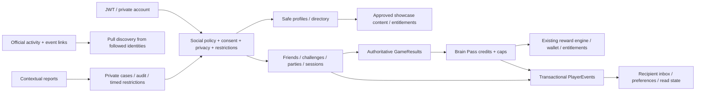

# Share7 social platform and Brain Pass — implementation record

Date: 1 October 2026. Baseline: backend `ae8c938` plus the verified, uncommitted multiplayer P4
continuation on `codex/finish-multiplayer-platform`; Unity prototype `9c0e03a8`.
This is a new product scope. Completing the previous multiplayer foundation did not complete it.

## 1. Architecture assessment (before implementation)

| Area | Actual implementation | Reuse / gap |
|---|---|---|
| Backend | ASP.NET Core modular monolith; Application interfaces, Domain entities, Infrastructure EF SQL Server, API controllers | Add modules in the same solution and DI root; no parallel backend |
| Identity | ASP.NET Identity GUID accounts, JWT; privileged tokens revalidated; Content Studio has a separate audience | Caller from token; verified presentation must never supply role claims |
| Private profile | `UserProfileService`, `StudentProfile`, `Users/profile` | Self/admin account fields; legacy other-user reads expose real name/age/grade and require repair |
| Safe identity | `IRosterNameResolver`, `PlayerDisplayName` | Generated handles reused; no public login username, age, contact or curriculum identifiers |
| Social graph | `FriendService`/`Friendship`/`FriendRequest`, guardian `SocialPlay` consent, `PlayerBlock` | Mutual friends already exist; following official accounts is a separate directed edge |
| Authorization/privacy | `ISocialPolicy`: active classmates or consenting friends; blocks override | Extend this central gate with restrictive settings and sanctions; avoid policy only in the new UI |
| Presence | `IPresenceReader`: recent feed polls plus real session seats | Reuse actual state; never make scheduled announcements look like live presence |
| Multiplayer | Registry, invites, parties, challenges, ranked tickets, Photon tickets, server match results, tournaments | All social actions reuse their existing authorizers and reservation/seat path |
| Events | `PlayerEvents` transactional publisher, SQL replay + long-poll, cross-instance fallback, seven-day retention | Reuse delivery; add recipient read/preferences and official pull activity, not a second socket |
| Progression | Server lesson grading/evidence, level curves, objective projector, daily/weekly quests, achievements, streaks | Brain Pass consumes authoritative results; objectives remain the quest engine |
| Economy | `RewardService`, reward rules, wallet ledger, product grants, entitlements, claim savepoints | Tier claims use this payout engine; seasonal XP is progression, never a spendable wallet currency |
| Results | `GameResults`, plausibility flags, per-user/sequence indexes, multiple projection consumers, retention | Bounded idempotent credits by result ID avoid losing a late commit behind a sequence watermark |
| Cosmetics | Backend equipment snapshots, product/entitlement ownership; Unity Addressable catalog/body config | Showcase selection uses approved content keys and entitlements; reuse `AvatarFactory` + `RemoteEquipmentView` |
| Unity | `GameBootstrap`, `IApiClient` and endpoint model, account-scoped stores; Stagelight screens/importer | Domain/service state outside views; cancellation and account epoch protect shared-device switching |
| Rendering | `AvatarScenePreview`, avatar builder, ref-counted `IAssetProvider`, RenderTextures, device-tier service | Reusable showcase lease owns avatar/props/camera/texture; late loads released on close; mobile fallback |
| Admin | React `Share7.Web`, navigation/permission registry, reward/commerce/event/objective tooling, transactional audit | Extend the existing console with profiles, moderation and Brain Pass configuration |
| Telemetry | Registered schemas, first-party ingest/rollups, consent, client typed events | Add typed social/Brain Pass vocabulary; avoid a separate identifying analytics pipeline |
| Moderation | Blocks, consent, staff audit, leaderboard/run review; no player report/case/sanction workflow | Implement contextual reason-code reports, private evidence and audited timed social restrictions |
| Testing | Real SQL temporary DBs; real HTTP contract host; Unity EditMode fixtures; HTTP load harness | Add privacy/IDOR/concurrency/claim/rollover/load checks; preserve existing snapshots |

Reviewed the real Profile, Crew and Inbox reference images, their V6 view scripts, scenario list,
experience ledger, avatar/resource APIs, bootstrap and backend collaborators. Crew is presently
hidden and its legacy preview uses a username as an invite code; that must not ship as friendship.
There is no existing Brain Pass module, verified public-profile directory or moderation queue.
The Unity CLI is absent from PATH despite the installed Pipeline package; recover its supported
entry point before serialized/editor work. Never substitute a guessed scene YAML edit.

Existing debt: full backend suite has 17 documented shared-fixture leaderboard/reward/signal
failures. Older architecture documents contain superseded capability lists. Existing objectives
may query extensive per-player history; the new consumer must remain bounded. No production-scale
throughput measurements have been supplied. These are limits, not evidence of production readiness.

## 2. Product scope

| Ship in this scope | Foundations exercised now | Deliberate future extensions |
|---|---|---|
| Safe player showcase reads; self showcase selection; official/creator/team identity and directory | Approved typed presentation/content definitions; immutable economic content keys; asset-quality contracts | Creator-specific finished chemistry art, advanced camera/VFX packages |
| Existing friends, requests, classmates, presence, invites, parties and challenges in Crew | Central restrictive privacy, block/mute, consent and sanctions | Student follower graphs, friends-of-friends, open student search, clubs/teams, gifting, unrestricted messaging |
| Follow approved official profiles; real official activity/event discovery | Pull reads over official activity; no follower fan-out; existing event/tournament authoring | Recommendations/rivals, collaborative groups, push fan-out and regional realtime workers |
| Persistent recipient inbox read state/preferences, fixed action targets | Existing transactional player feed; whitelisted templates/deep links; expiration | Mobile push providers and delivery receipts |
| Reports and moderation cases, timed social restrictions, audit and appeal request | Server-captured contextual evidence; no free-text student submissions; staff permission boundary | Automatic abuse classification, dedicated case managers, approved text moderation |
| Brain Pass seasons, tiers/free/premium, capped XP, atomic claims, season rollover, existing quest integration | Authoritative `GameResults` consumer and reward/entitlement boundary | Prestige/endless tiers, catch-up policy beyond authored caps, gifting or monetized pass offers |
| Required live-ops console and actual bilingual client flows | Existing UI pipeline and services, typed analytics and operational metrics | Redis/backplane only when deployment measurements require them |

No real-money price, pay-to-win perk, spam reward or stranger messaging. Premium is a server-owned
product entitlement and cosmetic/reward track; the existing adult-reviewed commerce boundary owns
any future sale. No creator identity or art is fabricated: an operator configures an approved real
account and delivers art against the content contract.

## 3. Boundaries and invariants

**Profiles:** ordinary accounts are visible only to self or permitted connections, with explicit
profile/stat/activity/presence scopes. Official discoverability is an operator-controlled exception,
never a student's opt-in to an unbounded public directory. Everyone sees safe handles and approved
identity metadata; private fields never enter DTOs/cache keys/activity. Blocks apply to official
accounts too. Verification/presentation enums are data and cannot become administrative claims.

**Privacy:** default connection visibility, with Friends/Connections/Nobody; narrowing never needs
guardian consent, broadening cannot bypass the relationship/consent gate. Invite, challenge and
presence settings are enforced by the existing `ISocialPolicy` calls as well as profile reads.
Sanctions cannot be removed by changing settings, and expire by server time. No public friends or
student follower lists. Follow is unidirectional and limited to approved official identities.

**Showcases:** safe content key, kind, minimum quality, asset contract version, optional product
ownership and official-only flag. Server validates selected content, count and ownership. The
client maps approved keys through an Addressable content definition, never executes a URL, script
or arbitrary JSON supplied by a player. Missing/retired assets degrade to the current dressed
avatar/default stage; ownership and learned progress survive a missing art package.

**Creator scale:** directory/profile pages bounded at 50; keyset cursors; no follower-count row
updated on every read. Publishing an official activity inserts one row, not one per follower.
Presence is pulled for the few identities on screen. Cache only non-personal presentation config;
authorize before delivering any per-viewer state. A future push adapter batches out of band.

**Inbox:** the existing feed remains the replay protocol. Inbox exposes current recipient events,
category/template/action metadata and recipient-owned read receipts. Fixed template keys localize
in Unity; authored event titles remain backend-localized. No arbitrary URL deep links, token fields
or free-text messages. Preferences/mutes filter presentation; required safety/reward state remains
recoverable from its authoritative API. Feed gaps always refresh state.

**Moderation:** reason enum plus real visible target/session; evidence captured on the server from
that context. Unknown/unavailable targets yield neutral errors. Repeated report key is idempotent;
bounded daily reports and staff-only paginated queue. Audited case decisions, restrictive timed
sanctions and reason-code appeals. Reporting is not XP-worthy. Erasure removes all user-bearing
edges/evidence in both directions through the existing purge/cascade coverage guard.

**Brain Pass:** published seasons are immutable and cannot overlap; draft editing and publish
validation precede activation. Only a server timestamp within its real window qualifies. The claim
grace window is separate from earning. No client XP endpoint. Rules select a restricted known
authoritative metric, bounded units/minimum/per-source XP/daily XP. Lesson best improvement uses
per-source maximum so repeating the same lesson never earns the same score twice. Session/run
rules require qualifying settled participation; fast quitting and flagged rows earn nothing.
Friend requests, follows, clicks, presence and profile views earn zero. Existing objectives supply
daily/weekly/seasonal quests without a second quest engine.

Each result is consumed once by `(season, resultId)`; each player/source/rule has bounded credit;
each daily rule bucket has a cap. A per-player transactional lock serializes concurrent projection
and claims. Results committed late remain eligible; no fragile global high-water mark. Retention
must keep unpublished credits for a published season until processed. Tier `(season,user,tier,track)`
claim and existing reward ledger commit together. Premium ownership is rechecked server-side.
Disconnected retries return the same grant, and payout failure never consumes a tier claim.

## 4. Threat and scale review before implementation

| Attack / failure | Required defense / degradation |
|---|---|
| Student self-assigns creator/verified status | No player identity write; SuperAdmin controlled, transactional audit; no role mutation |
| Probe profiles through old private-profile endpoint | Remove private fields from non-self/non-admin reads; safe-profile endpoint gates visibility; review contract behavior |
| IDOR/private room join through presence | No private room/lesson identifiers in profile/presence; ordinary invite/seat authorizer still decides |
| Block/consent/privacy bypass via another route | Extend the central gate; test existing invites/challenges/parties and profile/actions |
| Celebrity goes online | Zero synchronous follower writes; bounded pull queries; no open student discovery |
| Activity or inbox spam | No student free-text publisher; dedupe, preference/category filtering, retention and fixed templates |
| Fake earned XP / clocks / forged premium | No XP body; server result and timestamp; actual entitlements; immutable published config |
| Duplicate claims / workers / late result commit | SQL keys, transactions, per-user locking, credits by ID; fail/retry safe |
| Invalid reward/config or season rolls over | Refuse publish; completed earning window preserved; bounded claim grace; never reset account level |
| Database unavailable / slow | Preserve last account-scoped read, disable mutations, retry same intent keys; never grant locally |
| Realtime/Redis unavailable | SQL APIs and feed fallback are truth; Redis is not introduced as a dependency |
| Missing asset / rapid profile navigation | One cancellable owned resource lease; release stale loads, unload on close; existing avatar fallback |
| Logout or family account switch | Cancel old poll/load epoch; clear private caches; do not apply late previous-account responses |
| Reports used as XP or sanctions spam | No XP; rate/cap; only authorized staff create restrictions, with reasons/audit and appeal |
| 1M accounts | O(page) graph reads, bounded workers, no synchronous fan-out; index/SQL/latency measurements before a capacity claim |

## 5. Implementation and evidence ledger

| Prompt phase | Status at audit |
|---|---|
| 1 audit | Assessment above complete; evidence paths cited |
| 2 product/system design | V1/foundations/future split above; UX Integration Brief prepared separately |
| 3 architecture | Boundaries/invariants/query patterns above; exact contracts updated with implementation |
| 4 threat/scale | Review above; tests must prove defenses |
| 5 backend | Implemented: privacy, safe profiles/showcase, curated discovery/activity, teams, inbox, consent, moderation/appeals, Brain Pass, rooms/observers/retention and prize review; migrations generated locally |
| 6 Unity | Pending service integration and brief/reference approval before new screens |
| 7 showcase | Pending reusable renderer/content contracts; final creator art human-authored |
| 8 Brain Pass | Backend/reward-engine integration implemented and SQL/HTTP/restart tested; client pending |
| 9 admin/live ops | Console authoring/moderation/prize review implemented; typecheck and production build passed; actual browser flow review pending |
| 10 tests | Final complete backend suite: **1111 passed, 0 failed, 0 skipped**, 5m38s; SQL, HTTP roles/restart, concurrency/load and erasure guards included; Unity pending |
| 11 polish | Pending actual running flows and device/resource evidence |
| 12 documentation | Living record; complete only with accurate final evidence and remaining boundaries |

Do not mark the product complete while UI, tests, operations or art requirements are outstanding.

## 6. Approved prerequisites and current evidence

Session policy approved by the user: full ended sessions for 90 days, then minimal participant/admin
summaries for one further year. Expiry is derived from end+455 days; delayed jobs cannot extend it.
Independent prize, reward and rating records retain their existing policies. Guardian SocialPlay
remains a bit on the existing verified guardian link. Reporting includes a real staff reader,
audited decisions, timed/permanent restrictions, reason-code appeals and audited upheld/revoked
review outcomes; permanent decisions require SuperAdmin. Physical prizes require eligibility/fraud
review and real verified guardian confirmation for minor/unknown-age winners; no automatic delivery.

Public rooms reuse atomic seating. Private teams reuse consent and membership without a team wallet
or text chat. RoundRobin is additive and capped at 16. Observer capability remains default off until
a real game/protocol client adapter enforces its separate lease/role; no observer is a player seat.
All seasonal rewards consume the existing result stream and reward engine. No hardcoded season,
public child directory, XP mutation route, synchronous celebrity fan-out or separate notification
transport was introduced. Exact endpoints, resource contracts and runtime obligations are in
`SocialPlatformUnityContract.md`.

Full-suite review also repaired leaderboard cycle rebuild isolation/concurrent projection and
multi-level run payout summaries. Test fixtures now scope boards to their games, use actual elapsed
run time and isolate global XP pricing/curve/checkpoint mutations. These changes retain production
validation and retry semantics rather than weakening bounds to make tests pass. No remote database
has been migrated, no hosted deployment has run, and no final Unity completion is claimed.
